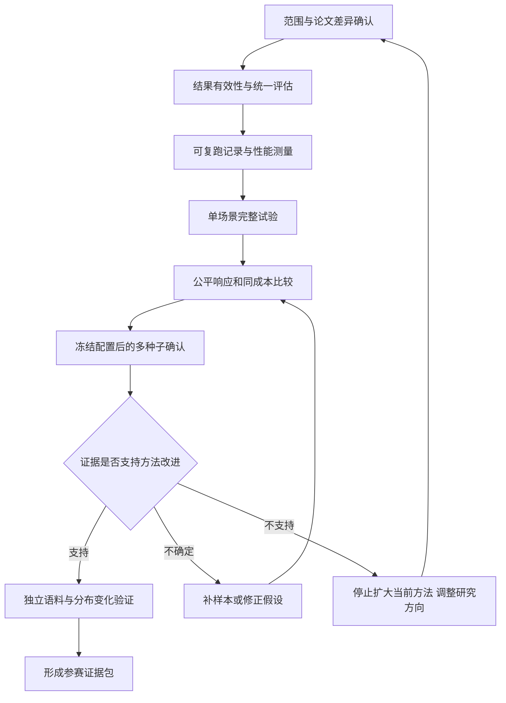

# ZipfGuard 下一阶段完整目标与执行计划

> **最新主线（2026-09-25）：**请以 [19 数据集核验与下一阶段任务书](/Users/cjx_main/Desktop/new/MMJS/ZipfGuard/docs/PIPELINE_NEXT_PHASE_2026-09-25.md) 为准：固定 19 个 MAYA 数据集，重点推进分布、拟合、分析、多模型攻击和评价；修改建议保留为固定对照。下文是较早版本的工程与统计补充。

> **用户补充后的执行主线：**参加全国密码竞赛，要求多篇论文支撑，并在 HTPG 原论文场景上优化。请以 [Agent 详细执行任务书](/Users/cjx_main/Desktop/new/MMJS/ZipfGuard/docs/AGENT_NEXT_PHASE_TASK.md) 为实施主文档，以 [研究引用表](/Users/cjx_main/Desktop/new/MMJS/ZipfGuard/docs/RESEARCH_REFERENCES.md) 为文献依据。本文件保留为工程验收与统计设计补充；其中合成 40 次预算实验用于回归诊断，不能替代原场景主实验。

> 制定日期：2026-09-25。依据第四次核查，正式项目目录为 `/Users/cjx_main/Desktop/new/MMJS/ZipfGuard`。
>
> 本文是下一阶段的执行计划，不代表任务已完成。所有待办需以代码、测试或实验产物验收。比赛名称、截止时间、团队人数和投入时间尚待确认；以下按工作依赖安排，并给出可调整的排期。

## 0. 下一阶段的总目标

**把当前 v4 原型推进为一个方法定义清楚、评估结果可信、能够独立复跑，并能判断创新是否成立的研究版本。**

阶段结束时必须回答：

1. 哪些论文方法已经复现，哪些采用了替代实现？
2. 修改建议是否正确执行，用户拒绝或执行失败是否被完整保留？
3. 观察到的收益是否来自策略本身，是否排除了候选漏收、用户响应差异和测试集调参？
4. 在同样修改成本下，新方法与论文方法及明确命名的基线相比怎样？
5. 结果在不同攻击预算、攻击器和分布条件下是否仍成立？
6. 根据证据，下一步是扩大验证、修改算法，还是缩小参赛主张？

**阶段验收不要求强行得到正收益。** 可复现的零／负结果，加上明确的方法调整决定，也属于有效阶段产出。只有正面证据达到另行规定的标准，才允许把“改进有效”写进参赛材料。

## 1. 起点：当前已有什么、还缺什么

### 已核实的基础

- 里程碑提交 `a8be6b2` 保存了候选修复前的实现；v4 修复仍包含未提交改动。
- Zipf 回归、曲率头尾划分、九特征、IGR、逐口令建议及模拟执行已有实现。
- 新执行器能区分成功、已满足、无法执行与冲突，拒绝不会删除用户。
- 主候选通过同一执行器枚举一步、两步响应，包含确定性和多样化长度响应。
- 训练／验证／测试已增加修改导致的候选漏收检查；主指标可以拒绝发布。
- 17 项定向测试通过；这不是完整测试套件通过结论。
- 固定种子 1、900 用户、预算 40 的频次诊断中，原有确定性伪收益已消失；长尾多样化剩余约 1.11 个百分点，尚无统计或独立攻击验证。
- RockYou 支持论文分布核对；MAYA 目前支持外部频数与特征排序分析。

### 本阶段的主要缺口

- 无效主指标尚未统一传递到配对统计、头部指标、汇总、网页和表格。
- 预算曲线、消融和旧入口尚未全部复用主实验规则。
- 没有当前 v4 的完整、可追溯主实验报告。
- 没有公平的同成本优势证据，也没有真实跨站策略效果证据。

## 2. 完成标准与优先级

| 等级 | 含义 | 本阶段处理原则 |
| --- | --- | --- |
| P0 | 缺失会使结果错误、不可比较或不可复跑 | 正式主实验前完成 |
| P1 | 决定创新论证和独立验证的完整性 | 基线可信后完成核心部分 |
| P2 | 扩展展示或额外模型 | 有明确收益且资源允许时再做 |

本阶段最小交付必须包含：

- [ ] 统一的结果有效性规则及回归测试。
- [ ] 论文复现差异表、威胁模型与冻结的实验协议。
- [ ] 一份当前版本的完整场景结果与复跑记录。
- [ ] 同响应、同成本的主对照结果。
- [ ] 多种子、预算及攻击器诊断，包含负结果。
- [ ] 一份“继续／调整／停止当前方法”的证据决策说明。
- [ ] 下一阶段独立语料验证的可执行配置；若完成效果实验，则另交对应报告。

## 3. 工作依赖与阶段门槛

不得跳过 B 直接跑更多结果，也不得把 D 的单场景结果当作 F 的确认结果。

## 4. 工作包 A：确定范围与论文复现口径

### A1. 比赛约束与资源表｜P0｜可立即开始

**任务：**

- [ ] 补充比赛名称、截止时间、作品类别、报告与演示要求、开源和数据提交要求。
- [ ] 记录成员、每日投入时间、机器配置、可用磁盘和实验时间预算。
- [ ] 将评分要求映射为现有或待产出的证据，避免把网页功能数量当作研究完成度。
- [ ] 未知信息保留“待确认”，不影响先做正确性修复。

**交付：**更新 `docs/COMPETITION_SCOPE.md`，另附资源与职责表。

**验收：**团队能用一页说明交什么、何时交、每项要求由什么证据支撑。

### A2. 论文算法逐项对照｜P0｜与 B 并行

**任务：**

- [ ] 对照原论文记录拟合频次门槛、曲率公式、取整、特征定义、IGR 权重、建议判定、并列规则和迭代设置。
- [ ] 明确 `>3` 的论文拟合与合成场景 `>0` 的适用范围。
- [ ] 区分论文的距离并列规则与当前严格比较规则。
- [ ] 记录词表替代、类别众数距离、语言范围和编码处理。
- [ ] 解释哪些动作能实现，哪些只能返回无法执行；不能把替代执行器等同真实用户行为。
- [ ] 保留 RockYou 总频数差 93,107、切分名次差异等未解决事项及排查证据。

**交付：**建议新增 `docs/PAPER_REPRODUCTION_MATRIX.md`，每行包含论文位置、实现位置、验证例子、差异及影响。

**验收：**每个“论文复现”结论都有对应实现和限制；严格版与改进版若不完全相同，结果命名可区分。

## 5. 工作包 B：把结果有效性贯通整个系统

### B1. 统一有效性状态｜P0｜依赖当前审计

**任务：**

- [ ] 为每个场景、策略和攻击协议保存明确的有效／无效状态、原因及受影响指标。
- [ ] 漏收发生在训练、验证或测试任何阶段，都不能让受影响的封闭安全收益作为正式结果发布。
- [ ] 同步处理绝对收益、相对收益、头部收益、配对区间、均值及最坏攻击者摘要。
- [ ] 保留原始诊断数值，但放到诊断字段，避免下游直接当作主结果。
- [ ] 开放生成结果独立判断有效性；候选列表错误不必自动否定真正独立的开放评估。
- [ ] 明确“原本未知口令”和“执行后被漏收口令”是不同情况。
- [ ] 比较两种方法时，基线或新方法任一无效，则该比较无效。

**主要位置：**`experiments/robustness_protocol.py` 的选择、评估、汇总与曲线；相关指标公共逻辑。

**验收：**同一人工漏收样例不能通过换一个字段或图表重新变成“正收益”。

### B2. 空值与错误原因的展示｜P0｜依赖 B1

- [ ] HTML、CLI、自动表格和图表接受不可发布状态。
- [ ] 显示“未发布”及具体原因，不能显示 0，也不能保留上一轮的成功图。
- [ ] 将计划种子数、有效种子数、失效数同时展示。
- [ ] 主比较存在失效运行时，优先停止结论发布并修复；有效子集仅可作为明确标注的诊断。
- [ ] 若区间无法计算，显示原因，不能用零宽区间替代。

**验收：**受控漏收样例在浏览器、终端和导出表中均正确呈现，无格式化空值异常。

### B3. 合并主表、曲线和消融的评估路径｜P0｜依赖 B1

- [ ] 多预算曲线检查训练／验证／测试，而不仅检查测试。
- [ ] 将旧 `compare_scenario` 迁移到共同核心，或明确归档并从正式入口移除。
- [ ] 将多轮迭代、采用率敏感性实验的权重、候选与审核范围单独记录。
- [ ] 让主命令的响应配置传入对应附属实验；若附属实验故意固定条件，单独保存其配置和用途。
- [ ] 配对方法使用相同数据划分、预算、响应能力、采用规则与统计口径。
- [ ] 固定 Length／LSD 的当前 `no_igr` 改名为固定特征对照；如要真正消融 IGR，明确只改变哪个机制。

**验收：**同一策略和同一配置从主表、单预算曲线、独立比较入口运行，相关指标一致。

### B4. 增加有针对性的回归检查｜P0｜依赖 B1–B3

- [ ] 原 5.00／11.11 个百分点伪收益反例不会再次被发布。
- [ ] 训练或验证漏收、测试恰好无漏收时，也不能发布被污染的结论。
- [ ] 一个种子失效时，不能给出伪装成完整五种子的均值。
- [ ] 采用率 0 不改变用户；拒绝、失败不删除用户。
- [ ] 两种响应模式及两步组合的输出覆盖得到验证。
- [ ] 论文权重主表与曲线一致。
- [ ] 预算、响应、种子、样本量修改后，相应配置与来源身份同步变化。
- [ ] 实际点击一次网页异常路径，确认旧结果清除及错误说明显示。

**验收：**修复前能触发的实质反例在修复后通过，不只测试字段是否存在。

## 6. 工作包 C：可复跑记录与计算成本

### C1. 每次运行保存完整身份｜P0｜依赖 A2、B3

- [ ] 源码提交与工作区状态；未提交源码还需内容哈希。
- [ ] 所有关键源文件、词表、候选生成方式和攻击器版本。
- [ ] 数据版本、清洗方式、划分比例及哈希；真实口令不写入公开结果。
- [ ] 预算、选择预算、成本参数、响应模式、采用率、种子及种子用途。
- [ ] Python、依赖版本、机器与运行时间。
- [ ] 候选哈希在运行时保存，不能事后重建后假装是当时的候选。
- [ ] 每种子保存选择特征、执行状态计数、修改率、三个阶段的空间审计和攻击分项结果。

**交付：**正式结果目录结构和字段说明；建议按运行 ID 建目录，避免覆盖历史报告。

**验收：**任何主图能追溯到唯一配置和结果文件；修改代码或词表后，旧表验证能明确报告过期。

### C2. 固定环境并建立复跑命令｜P0

- [ ] 选一个项目支持的解释器版本，固定依赖安装方式。
- [ ] 从新环境安装并运行定向测试、完整场景与表格生成。
- [ ] 保存实际有效配置，避免依赖散落在脚本中的默认值。
- [ ] 当前验证使用过 Python 3.12，旧报告记录过 3.14；环境差异需明确，不将源码一致等同环境一致。
- [ ] 交付一份不需要阅读实现细节即可复跑的说明。

**验收：**至少两个独立环境得到一致的确定性结果；若数值允许浮点误差，事先给出容差和原因。

### C3. 先测量，再决定实验规模｜P0

已知本机 314,135 个候选首次构建约 61 秒。正式评估还包含训练、全候选 n-gram 评分与区间计算，不能由这个时间推断整套实验耗时。

- [ ] 分开记录候选构建、建议选择、攻击训练、排名、指标统计、区间和导出的耗时及内存。
- [ ] 缓存候选集合和稳定哈希，避免样本循环内重复构造集合。
- [ ] 缓存相同训练结果的评分；同一排名可同时算多个预算。
- [ ] 缓存键必须覆盖数据、源码、候选、配置和攻击器身份，避免错误复用。
- [ ] 测量正常运行与性能分析模式的差别，不让全程追踪内存扭曲正式耗时。
- [ ] 预算曲线若固定选择预算，只选一次；若研究“随预算选择”，每档在验证集独立选择，并另命名协议。
- [ ] 在扩展网格前估算总耗时、磁盘与内存，超出团队资源时先缩减次要实验。

**验收：**有明确资源账单；优化前后同一配置结果一致；没有为了加速改变评价口径。

## 7. 工作包 D：建立可信的单场景基线

### D1. 先跑完整链路｜P0｜依赖 B、C

第一份试验建议延续已有诊断条件，便于定位变化：长尾、900 用户、种子 1、选择预算 40，分别运行两种响应。该种子属于开发诊断，不能宣称是未看过的确认集。

对照至少包含：

| 对照 | 用途 |
| --- | --- |
| 无修改 | 给出收益基准 |
| 论文 IGR 实现 | 核对论文顺序的效果，标注复现差异 |
| 当前预算／成本方法 | 待验证方法 |
| 头部触发长度响应 | 当前明确可实现的简洁基线 |
| 固定两特征对照 | 判断选择器是否优于简单预设 |

字符类别规则可作历史附录。当前头部触发长度响应不自动等于完整现代口令政策；如要使用“长度＋黑名单”名称，须实现并验证修改后的黑名单合规条件。

**每条臂必须输出：**

- [ ] 用户数、原头部用户数、建议触发数、修改数。
- [ ] 成功、已满足、无法执行、冲突、拒绝的计数和分母。
- [ ] 训练／验证／测试原始空间外与修改导致空间外质量。
- [ ] 冻结及自适应频次、n-gram 结果；独立的开放生成结果。
- [ ] 全体用户主指标，头部用户辅助指标；绝对百分点与相对百分比分开。
- [ ] 实际修改成本和运行资源。

**验收：**完整结果可解释，不缺阶段；无效项明确不可发布；数字能由保存配置复跑。

### D2. 正确解释单场景结果｜P0

- [ ] 若新方法不修改，记录各候选动作的验证得分和未选原因。
- [ ] 若修改但无收益，区分统一改名、集中到同模板、攻击者自适应等原因。
- [ ] 若有收益，先排查响应多样性、候选空间、覆盖和成本差异。
- [ ] 若某攻击器未完成，记录原因；不能用更弱攻击器自动替换后保留原标签。

**验收：**团队能够解释当前 1.11 个百分点信号来自何种动作和条件，并知道它尚未证明什么。

## 8. 工作包 E：把“有收益”改成“公平条件下有优势”

### E1. 冻结响应与成本定义｜P0｜依赖 D

共同响应因子：deterministic 与 diversified。共同采用率：主实验先固定 1.0；0.5、0.2 用作另列的敏感性场景，不当作真实用户数据。

主成本建议用“改变口令的用户比例”，同时报告：

- 字符编辑量或归一化编辑距离；
- 长度变化；
- 每用户建议尝试数；
- 失败与冲突比例。

上述指标是可计算代理，不能称为真实记忆成本、满意度或可用性评分。

**验收：**同一条响应规则不因方法名称而改变；不同方法的成本计算相同；不同成本指标不混为一个未经验证的分数。

### E2. 同成本比较与曲线｜P0

- [ ] 在验证集上调成本权重或修改配额，不在测试集上追求恰好相同的修改率。
- [ ] 事先声明若干成本档位，例如 5%、10%、20% 的修改配额，作为拟议实验配置；若方法达不到档位，记录不可达。
- [ ] 所有比较报告测试集实际修改率；名义配额相同不保证实现成本完全相同。
- [ ] 在共同可达的成本区域比較，不在缺乏数据的区域外推优势。
- [ ] 同时给出相对于无修改、论文臂和简洁基线的差异。
- [ ] 固定动作空间、用户响应和攻击器后，再判断选择算法是否有额外价值。

**交付：**安全—成本曲线、指定成本档位的主表及配置选择说明。

**验收：**能够回答“相同代价下是否更安全”，而非只说“改的人更少”或“猜中率更低”。

### E3. 算法候选与真正的消融｜P1

一次只研究一个清楚的问题：

1. 验证集收益排序是否优于论文顺序？
2. 联合评估两条建议是否优于分别打分取前两项？
3. 跨攻击器选择是否比只对频次攻击选择更稳定？
4. 在头部变化时，训练集精确 HeadSet 门控是否限制收益？

每个候选先在开发实验中筛查，不能同时堆入多个模块再把提升全部归给“创新”。

- [ ] IGR 消融固定其它筛选、响应和成本，只更换排序／使用 IGR 的环节。
- [ ] 成本消融只改变成本约束，仍报告其实际修改负担。
- [ ] 自适应消融明确区分攻击训练方式变化，不能混入候选变化。
- [ ] 去掉预算项的替代方法应仍有合理决策规则；“把收益设为零所以无人修改”不能单独证明预算项的研究价值。

**验收：**每一条消融能用一句话说明唯一变化；其结论有匹配证据。

## 9. 工作包 F：冻结后再做确认实验

### F1. 分层实验矩阵｜P0｜依赖 E

以下是建议配置，执行前写入协议并冻结；不是已完成结果。

| 层级 | 机制 | 种子 | 用户规模 | 响应／采用率 | 预算 | 目的 |
| --- | --- | --- | --- | --- | --- | --- |
| 开发诊断 | Zipf、长尾 | 已用 1–5 | 900，必要时 300 | 两种响应／1.0 | 40 | 排错与选择方法 |
| 主确认 | Zipf、长尾 | 新冻结的 10 个种子 | 经资源测量确定，记录测试人数 | 两种响应／1.0 | 主预算 40 | 确认同成本比较 |
| 预算诊断 | 与主确认相同 | 同一批种子 | 同一划分 | 主配置 | 10、20、40、80 | 同一计划的预算曲线 |
| 采用敏感性 | 主确认中预选场景 | 固定种子组 | 同一规模 | 0.5、0.2 | 40 | 响应假设敏感性 |
| 偏移诊断 | head_shift、unknown_structure | 独立固定组 | 同一规模 | 预选响应 | 40 | 适用范围 |
| 外部验证 | 经核查的独立语料 | 固定划分 | 由语料和算力确定 | 明确模拟假设 | 经测量选择 | 外部有效性 |

不要一次执行全笛卡尔积。先通过完整试验和资源测量，再安排主确认；敏感性与偏移按预先选定的子集开展。

900 是总用户数，按现有划分测试只有 180 人。10 个种子也不是足以保证统计结论的魔法数字。若目标差异很小，应根据开发期方差与资源调整规模，并在查看确认结果前固定。

新种子仍来自相同合成生成器，不能称为独立真实数据验证。

### F2. 指标与统计规则｜P0

定义每个攻击器在预算 B 下的测试猜中率：命中测试用户数／全部测试用户数。绝对收益为参考方法猜中率减去新方法猜中率，展示为百分点。

- [ ] 主比较对象、预算、成本档位、响应模式和主指标事先指定。
- [ ] 封闭频次与封闭 n-gram 可另报最坏值；开放生成不与封闭排序混成同一个最大值。
- [ ] 报每个种子的原始指标、同种子方法差及有效性，不只报最佳种子。
- [ ] 在同一用户集上比较时使用配对差；跨种子说明种子层面的变异，不把重复使用的用户简单当成独立新样本。
- [ ] 若对“最坏攻击器”计算区间，每次重采样重新计算最大值，不能只取某一个攻击器的区间冒充它。
- [ ] 若大量扫描方法／预算，以预定主比较为正式结论，其它结果标为探索；统计处理方式事先说明。
- [ ] 实用提升门槛与允许增加的成本在看确认结果前确定。单纯显著不等于值得采用。
- [ ] 无效种子、攻击失败、无法满足成本约束都保留，明确说明最终结论是否可发布。

**验收：**“优于”有明确参考、条件、差值和不确定性；有限合成结果不被外推为一般真实防御结论。

### F3. 防止确认集变成新的调参集｜P0

- [ ] 记录哪些种子、场景和报告已经被用于开发。
- [ ] 冻结算法、候选生成、成本选择规则后才运行确认集。
- [ ] 确认后若修改算法，记录新版本；此前确认集成为已查看数据，不能继续称作未触碰。
- [ ] 不因结果不理想丢种子、换主指标或只报头部用户。

## 10. 工作包 G：独立验证与创新边界

### G1. 外部语料先完成设计与数据核查｜P1

- [ ] 为每份语料记录频数含义、去重状态、来源、时间、清洗、规模和用途。
- [ ] 检查站点间的记录重叠与训练测试泄漏；相同口令字符串自然重合不自动等于账户重复，处理方式与研究问题一致。
- [ ] 明确外部语料用于原始猜测、模拟策略响应，还是仅分布拟合。
- [ ] 合成“公开完整支持集”的候选假设不能直接搬到真实未知口令场景。
- [ ] 使用真实语料训练／测试时，攻击候选必须来自允许的训练信息、公开模型及预定生成规则，不能由测试词表反推。
- [ ] 公开产物只包含必要的聚合结果与身份信息。

**本阶段最低交付：**独立验证协议、dataset card、划分配置与小规模可运行样例。完整效果实验在主方法与资源条件允许时推进。

### G2. 攻击器覆盖按主张决定｜P1

- [ ] 频次、n-gram、开放 Markov 各自有清楚角色。
- [ ] 若声称论文攻击结果复现，按论文设置补对应攻击器与预算，而非以替代器冒名。
- [ ] 若只声称新方法在指定攻击器下有效，准确限定适用范围。
- [ ] PCFG 已有适配器应优先评估能否接入统一协议；仅有适配器不等于主实验已经使用它。
- [ ] PassLLM 或其它大型模型仅在研究问题需要且有资源时加入。

### G3. 确认创新边界｜P1

- [ ] 围绕最终算法查原始论文和官方材料，比较动态策略、预算感知、成本约束、联合建议和分布变化处理。
- [ ] 分别说明论文继承、工程贡献和新方法贡献。
- [ ] 避免把增加权重、接入模型或修复评估错误本身直接称作方法创新。
- [ ] 每个创新主张必须指向对应对照与消融。

**验收：**最终贡献可以简明陈述，且其新颖性和有效性分别有依据。

## 11. 工作包 H：证据包与阶段决策

### H1. 交付文件清单｜P0

以下新文件名为建议，尚未创建：

| 产物 | 建议位置 | 内容 |
| --- | --- | --- |
| 论文差异表 | `docs/PAPER_REPRODUCTION_MATRIX.md` | 论文步骤、实现和差异 |
| 冻结协议 | `docs/EXPERIMENT_PROTOCOL.md` | 主比较、数据、响应、成本、攻击器、统计 |
| 运行清单 | 每次运行目录下 manifest | 配置、身份、环境、状态 |
| 每种子结果 | 每次运行目录下聚合结果文件 | 不含真实口令的完整诊断 |
| 主结果表 | 自动生成的 Markdown／图 | 同成本、多预算、区间 |
| 性能记录 | `docs/PERFORMANCE_NOTES.md` | 资源测量、缓存与复跑预算 |
| 外部验证设计 | `docs/EXTERNAL_VALIDATION_PLAN.md` | 语料、划分、候选、攻击与边界 |
| 阶段决策 | `docs/PHASE_DECISION.md` | 继续、调整或停止当前算法的证据 |
| 复跑说明 | 更新现有 `docs/REPRODUCE.md` | 从环境到报告的最短步骤 |
| 状态与报告 | 更新现有状态、技术报告 | 删除或明确隔离失效历史主张 |

### H2. 三种结果对应的决定

| 结果 | 下一步 | 允许的表述 |
| --- | --- | --- |
| 同成本下有稳定优势，独立攻击验证支持 | 扩独立语料、补适用范围、组织参赛成果 | 在已验证条件下有效 |
| 只有少数响应／预算有收益 | 分析条件，缩小研究主张，增加针对性验证 | 特定条件下存在收益 |
| 公平修正后无收益或普遍更差 | 停止扩大相同方法，调整动作／联合选择／偏移机制假设 | 当前假设未得到支持 |

“方法没有成功”与“这阶段没有完成”是两件事。阶段任务是获得可信结论，方法成功需要额外证据。

## 12. 排期与职责建议

下面按 2～3 人协作给出约 3 周的示例节奏，不是已确认的承诺；真实截止日期与资源确认后调整。时间紧时优先减少可选实验，保留正确性和公平性门槛。

| 时段 | 主目标 | 并行工作 | 放行条件 |
| --- | --- | --- | --- |
| 第 1–3 个工作日 | A、B：范围、论文差异、有效性与展示 | 比赛规则收集、环境锁定 | 漏收反例全链路正确处理 |
| 第 4–5 个工作日 | C、D：性能与单场景完整运行 | 数据卡、复跑说明 | 有当前版本完整报告 |
| 第 6–9 个工作日 | E：同成本对照与候选方法筛查 | 相关工作与外部验证设计 | 冻结方法、主比较及成本规则 |
| 第 10–12 个工作日 | F：确认实验和统计 | 验证图表、检查异常种子 | 无协议错误，结论边界清楚 |
| 第 13–15 个工作日 | G、H：独立小规模验证、证据决策 | 第二环境复跑、演示整理 | 阶段交付齐备，后续路线有依据 |

### 职责划分

- **工程负责人：**结果状态、公共执行路径、来源记录、缓存、网页异常和复跑环境。
- **实验负责人：**协议、数据划分、主网格、攻击评估、成本曲线和统计。
- **论文／交付负责人：**论文差异、相关工作、数据卡、报告和比赛评分映射。

两人团队可由实验负责人兼论文工作；单人按依赖顺序推进。方法设计者的结论最好由另一成员复核一组配置和原始聚合结果。

### 每日同步只检查四项

1. 今天关闭了哪个任务编号，其验收证据在哪里？
2. 是否改动了协议或算法，需要生成新版本吗？
3. 是否发现失效结果，哪些表和结论需要撤回或更新？
4. 下一项工作的前置条件是否已满足？

## 13. 现在可以直接开始的前十项任务

1. **B1：**定义统一有效性状态，列出受封闭漏收影响的全部指标。
2. **B2：**修复 None 在 HTML、CLI 和表格中的展示。
3. **B4：**加入训练漏收、验证漏收、缺失种子的端到端反例。
4. **B3：**让预算曲线复用三阶段审计，处理旧比较入口。
5. **B3／E3：**给固定特征对照准确命名，重新定义真正的 IGR 消融。
6. **C1：**保存实际响应、成本、数据划分和候选身份。
7. **C2：**固定环境，准备干净环境复跑。
8. **C3：**测量完整单场景的真实耗时，决定网格规模。
9. **D1：**生成一份当前版本的完整场景报告。
10. **E1／E2：**冻结共同响应与成本规则，开始同成本比较。

在这十项完成前，不把单种子 1.11 个百分点写成成果，不优先投入界面扩展或额外大型模型。

## 14. 现有关键文件索引

| 文件 | 本阶段用途 |
| --- | --- |
| [第四次核查](/Users/cjx_main/Desktop/new/MMJS/ZipfGuard/docs/PROGRESS_REVIEW_2026-09-25_V4.md) | 本计划的已验证起点 |
| [主实验](/Users/cjx_main/Desktop/new/MMJS/ZipfGuard/experiments/robustness_protocol.py) | 有效性、选择、主表、曲线、消融 |
| [建议执行](/Users/cjx_main/Desktop/new/MMJS/ZipfGuard/experiments/suggestion_compare.py) | 响应、目标校验、冲突、候选闭包 |
| [建议生成](/Users/cjx_main/Desktop/new/MMJS/ZipfGuard/policy/htpg_generator.py) | 论文建议口径与改进差异 |
| [来源记录](/Users/cjx_main/Desktop/new/MMJS/ZipfGuard/experiments/provenance.py) | 配置与环境追溯 |
| [表格生成](/Users/cjx_main/Desktop/new/MMJS/ZipfGuard/experiments/freeze_directed_table.py) | 过期检查、有效性展示 |
| [网页入口](/Users/cjx_main/Desktop/new/MMJS/ZipfGuard/web/server.py) | 异常状态与展示一致性 |
| [主协议测试](/Users/cjx_main/Desktop/new/MMJS/ZipfGuard/tests/test_robustness_protocol.py) | 回归与端到端验证 |
| [技术报告](/Users/cjx_main/Desktop/new/MMJS/ZipfGuard/docs/TECHNICAL_REPORT.md) | 当前结论与局限 |

**最终验收句：我们能拿出一份来源清楚、规则公平、可独立复跑的证据，说明预算感知建议在哪些条件下优于哪些基线，或明确证明当前方法尚未达到这一目标。**
