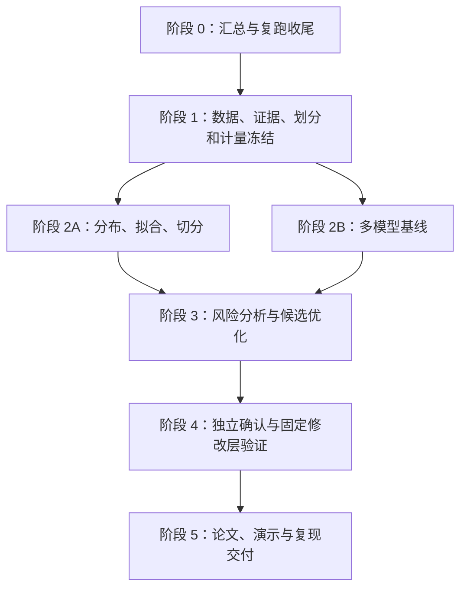

# ZipfGuard 下一阶段全面执行表

日期：2026-09-26。适用基线：第五次核验后的工作区。面向全国密码竞赛；具体届次、赛道、截止时间、提交模板、团队人数和算力仍待确认。

目标澄清：最终交付为密码技术竞赛作品；“论文水平”指研究深度与证据质量，不要求投稿或录用。本表提及论文的交付任务按竞赛技术报告执行，具体研究路线和标准见 [竞赛作品研究升级指南](./COMPETITION_RESEARCH_UPGRADE_GUIDE_2026-09-26.md)。

## 一、总目标：从可运行的小实验走向有证据的优化研究

项目继续使用既定 19 个 MAYA 数据集，在 HTPG 原论文场景上优化。整体主线是：数据身份可信 → 分布描述和拟合可信 → 切分与分析能够解释风险 → 多攻击模型在统一成本下评价 → 冻结方案后验证优化 → 回到固定修改层检查实际效果。

重点工作放在分布、拟合、分析、攻击、评价五个方向。修改建议层保留为稳定应用基线，只有复现错误或接口问题需要修复，不将扩展建议规则作为主要创新投入。五个方向需要完整工作，但最终只选择最多两个经验证据支持的主创新。

当前已经有 7 小站预处理重算、hak5 多模型小实验、真实等额配额试验和基础测试。它们应当复用，不要把已通过的工作全部推倒重写。现有 H1/H2 都未获得确认：固定质量阈值未显示更稳定，等额配额没有超过验证集选出的单模型；这不等于已经实现并否定全部候选优化。

### 状态规则

下表勾选框默认未勾选，表示“本表要求的完整验收尚未完成”，不是否认已有局部实现。已有基础在任务说明中标明。

| 状态字段 | 什么情况下可以设为 true |
| --- | --- |
| implemented | 真实入口可调用，必要依赖和错误处理已接好 |
| tested | 与该任务风险相关的测试或真实小实验通过，有运行证据 |
| experiment_completed | 预先声明的实验单元已结束，失败和缺失单元如实记录 |
| claim_supported | 预先定义的对照、统计和适用范围支持指定结论 |

脚本存在、JSON 存在、测试通过分别不能替代后两项。负结果可以是完整实验，不应被当作没有完成；运行失败不能当作零命中。禁止只追加一段“已完成”说明而不更新下游结果。

## 二、阶段总表与依赖

| 阶段 | 完成目标 | 进入下一阶段的门槛 | 本阶段不能声称 |
| --- | --- | --- | --- |
| 0 | 当前正确结果贯通主表、图表和复跑入口 | 干净输出目录可构建一致的小实验报告 | 完成全部科研实验 |
| 1 | 19 站均有明确身份、可用范围、划分与实验配置 | 任何结果都能找到输入、代码、模型、成本定义 | 来源未知等于来源已解决 |
| 2 | 完成预先定义的多站基线和分布拟合比较 | 基线运行状态、资源消耗与误差已量化 | 单站优胜等于跨站优胜 |
| 3 | 选择最多两个候选优化并冻结 | 仅开发/验证证据参与选择，测试方案写定 | 探索结果等于确认结果 |
| 4 | 独立测试与原场景验证完成 | 所有必需单元可追溯，负结果保留 | 合成修改等于真实用户行为 |
| 5 | 比赛材料与可复现包一致 | 独立环境复跑、数字和引用逐项核对 | 模型下载齐全等于论文复现齐全 |

以下角色只表示工作责任类型，不假定有多少队员：工程、数据、模型、研究、文档。执行前给每项填实际负责人；没有负责人不能进入进行中。工期待团队和硬件确定后填写，不虚构截止日期。

## 三、阶段 0：立即收尾，避免继续累积报告矛盾

| 勾选 / ID | 优先级 / 角色 | 具体步骤 | 交付物 | 验收标准 | 前置 |
| --- | --- | --- | --- | --- | --- |
| [ ] C01 | P0 / 工程 | 新建确定性的 attack_matrix 构建入口；读取当前专项 JSON；替换旧配额结构；禁止手抄结果；校验各来源 schema 和身份 | 主表生成脚本、更新主表、输入清单 | 当前主表明确显示生成 900 完成、唯一 821、命中 93；不再保留 resource_truncated 旧解释；改变专项输入后主表可重新生成 | 现有专项结果 |
| [ ] C02 | P0 / 工程 | 将 preprocess_identity 放到 diagnostics 前；补主表生成步骤；把神经实验等独立步骤在命令帮助中写清 | 更新复跑入口及依赖图 | 临时输出目录运行选定小流程成功；不依赖隐含历史 JSON；缺必要输入时准确失败 | C01 |
| [ ] C03 | P0 / 工程 | 身份文件缺失、版本不符、输入变化时拒绝当前结果构建；修复缺失时 sites_not_rescanned=[] 的误导 | 身份校验器、失败诊断 | 缺失身份不会被当作零个待重读站点；输入变化可定位需重算的产物 | C02 |
| [ ] C04 | P1 / 文档 | 分开或标注新预处理与历史未重读图；汇总均值注明站点集合；保留明确历史说明 | 更新重复率图和图注 | 7 个新站与 10 个历史站在现有 17 根柱中可区分；读图不需要查代码 | C03 |
| [ ] C05 | P1 / 工程 | 核对文档、主表、专项表的预算名、轴、分母、状态；清理过期完成声明 | 一致性核对记录、阶段报告 | PassLLM 原始/排序/唯一轴不混用；所有不完整单元不转为 0 | C01–C04 |
| [ ] C06 | P1 / 工程 | 保存当前可运行版本、依赖锁和模型校验值；把未跟踪的新脚本纳入版本管理；提交一个可回退里程碑 | 提交号、环境清单、运行命令 | 新检出代码包含所有必需脚本；模型可按校验清单恢复；不提交泄露口令或庞大权重 | C05 |

阶段 0 只修真实缺口。已通过的中断计量、split 频次指纹、词表缓存等应作为回归覆盖保留，不另起重复实现。

## 四、阶段 1A：权威依据与研究范围

每个 part 都要有依据，但“有引用”不等于“证明了创新”。正确关系是：权威材料定义已有方法、已知限制或评价原则；本项目实验提供对优化效果的新证据。任何创新声明都不能只靠引用支撑。

| 勾选 / ID | 优先级 / 角色 | 具体步骤 | 交付物 | 验收标准 | 前置 |
| --- | --- | --- | --- | --- | --- |
| [ ] R01 | P0 / 文档 | 核对本地 HTPG 论文版本、公式、算法、实验场景和参数；将原文要求映射到当前实现 | 原场景映射表 | 每项有论文页码/公式号、实现路径、已复现/有偏差/未完成状态 | 本地论文 |
| [ ] R02 | P0 / 研究 | 逐项建立“研究问题—依据—本地证据—适用边界”；查论文原文、出版社、作者材料 | claim_evidence 表、更新 references.bib | 五个方向都能查到直接支持相应设计的原始来源；没有仅靠博客或搜索摘要的核心论据 | R01 |
| [ ] R03 | P1 / 模型 | 补齐 PassGPT、PassLLM、MAYA 及实际启用模型的完整引文、作者代码版本、权重来源和许可记录 | 模型与数据来源表 | 论文、实现、检查点一一对应；蒸馏模型/随机采样/DivideSearch 分别注明，不能互相替代 | R02 |
| [ ] R04 | P1 / 文档 | 明确“HTPG 场景扩展”与“原论文数值复现”的边界；19 MAYA 数据替代原站点时明确说明 | 研究范围一页说明 | 不把缺原数据的结果称为完整复现原论文表格；不因此阻止 19 站优化研究 | R01–R03 |
| [ ] R05 | P1 / 文档 | 获取确切竞赛届次、赛道和官方要求；核对数据、引用、提交形式和日期 | 官方要求核对表 | 每项有官方来源及检查日期；未知项写待定；不能只凭“全国密码竞赛”推断具体规则 | 需用户补充赛事信息 |

### 现有引用起点与补证任务

以下是仓库现有文献的用途安排，不表示本清单重新核验了全部书目信息。执行 R02/R03 时须查看原文并记录支持位置。

| 部分 | 仓库现有引用起点 | 必须补充的证据 |
| --- | --- | --- |
| 分布、拟合、切分 | `xiao2022htpg` | 适合所用离散支持域的模型估计、拟合优度和不确定性原始方法来源 |
| 攻击 | `weir2009pcfg`、`duermuth2015omen`、`melicher2016neural` | PassGPT、PassLLM 及启用生成模型的原论文、官方实现与检查点对应关系 |
| 评价、跨域偏差 | `ur2015guessability`、`pasquini2021bias` | 具体指标、跨域设定、训练暴露及采样预算的原文依据 |
| 固定修改层 | `xiao2022htpg`、`blocki2013optimizing`、`segreti2017diversify` | 当前修改规则与原算法的逐项对应、可用性代理指标的解释边界 |
| 数据 | 本地 MAYA 目录、下载与审计记录 | MAYA 原始说明、上游格式化代码、频次和去重语义；特别是异常站点 |

## 五、阶段 1B：19 站数据、划分与资源基础

固定站点：rockyou、myspace、phpbb、linkedin、hotmail、mailru、yandex、yahoo、faithwriters、hak5、000webhost、singles、gmail、zomato、taobao、mate1、twitter、ashleymadison、libero。

全部 19 站都要有状态和来源记录；“纳入范围”不等于所有站点都能用同一种频次解释。若来源问题无法解决，保留站点并限制对应指标，不凭空补频次或把未知账户语义改成已核实。

| 勾选 / ID | 优先级 / 角色 | 具体步骤 | 交付物 | 验收标准 | 前置 |
| --- | --- | --- | --- | --- | --- |
| [ ] D01 | P0 / 数据 | 核实 MAYA 生产流程是否保留行结束符；记录可定位版本；验证 LF、CRLF、无分隔符、内部控制字符的处理边界 | 预处理规范及真实格式回归样本 | 去分隔符有来源依据；空值、控制字符、非字符串分别计数；不静默合并不同口令 | R02、现有 7 站审计 |
| [ ] D02 | P0 / 数据 | 为 19 站生成原始与有效数量、唯一数、单次比例、重复比例、长度和字符域摘要、排除原因 | 版本化数据卡 JSON/MD | 每项注明原始/有效分母、source hash、预处理版本；已有 7 站复用一致结果 | D01 |
| [ ] D03 | P0 / 数据 | 单独核查 LinkedIn、Ashley Madison 的计数、格式化、去重和账户对应；无法证实则给出可用任务范围 | 两站语义结论与限制 | 不把 occurrence、unique、account 混为一谈；至少明确哪些风险指标不可计算 | D01–D02 |
| [ ] D04 | P0 / 工程 | 先测内存峰值，再处理 12 大站；检查 pickle 是否整对象加载；制定顺序转换、足够内存机器或磁盘中间计数方案 | 资源预算和可扩展读取方案 | 不声称“分块读取 pickle”就能保证流式；可处理目标站点且不靠永久 >20 万跳过 | D01 |
| [ ] D05 | P0 / 数据 | 按 D04 方案补 12 大站重读；保留进度、恢复点和失败原因；与旧统计对比 | 19 站当前身份清单 | 每站明确重读完成或阻塞原因；失败不伪装为没有控制字符 | D02–D04 |
| [ ] D06 | P0 / 工程 | 定义分析身份：数据内容、预处理、词表、拟合配置、代码、划分、seed；定义模型运行身份和汇总依赖 | identity schema 与校验入口 | 更换任一实际影响结果的参数使相关缓存失效；汇总拒绝拼接不兼容身份 | C03、D01 |
| [ ] D07 | P0 / 数据 | 为 19 站生成 occurrence 60/20/20 与 unique-disjoint 两套清单；保留现有 hak5；写明二者回答不同问题 | split manifest、交集和频次摘要 | occurrence 允许同字符串跨集但保留记录划分；unique-disjoint 字符串交集为 0；指纹保留计数 | D05–D06 |
| [ ] D08 | P1 / 数据 | 在受控本地计算跨站重叠与公共模型训练暴露；区分已知、不明、可排除；只导出聚合 | overlap/exposure 表 | 不公开口令或可枚举的口令 hash 列表；不能证明无暴露时不称干净测试 | D07、R03 |
| [ ] D09 | P0 / 研究 | 把已反复查看的 hak5/Twitter 等结果列为开发证据；选择尚未参与调参的数据或明确重新划分的确认方案 | 开发/验证/确认使用台账 | 不把已据以改方法的测试结果再包装成完全未见确认集；有受限条件时如实披露 | D07–D08 |

## 六、阶段 1C：统一攻击计量与实验管理

| 勾选 / ID | 优先级 / 角色 | 具体步骤 | 交付物 | 验收标准 | 前置 |
| --- | --- | --- | --- | --- | --- |
| [ ] E01 | P0 / 工程 | 固定 raw/valid/unique/排序后验证各轴；定义有限词典耗尽、预算达到、资源截断、失败、中断；审计所有调用方 | 统一评价合同 | 无效、重复、中断通知、失败生成、短流和完整词典耗尽都有正确状态；适配器不提前丢弃需计成本的输出 | C05 |
| [ ] E02 | P0 / 工程 | 攻击生成只接收允许的训练输入；验证器可选模型和配额；测试标签仅供冻结后的评分 | 数据依赖检查与入口分离 | 测试频次不参与排序，测试命中不反馈给普通开放生成；闭合集排名单独命名 | D07、E01 |
| [ ] E03 | P0 / 模型 | 统一长短、编码、字符域和无效候选规则；同时输出全测试域和模型覆盖域指标 | 支持域报告 | PassGPT 的长度限制不能通过缩小总分母隐藏；不同域指标分别标注 | E01、R03 |
| [ ] E04 | P1 / 工程 | 记录训练、生成、排序、验证耗时和峰值资源；公共权重准备成本与单次推理分开 | 每次 run 的成本表 | 冷/热缓存、CPU/GPU、线程和批量大小有记录；同原始次数不自动称同计算成本 | E01 |
| [ ] E05 | P0 / 工程 | 建立任务清单、唯一 run_id、日志、错误分类、恢复/重放策略；避免整段大 stdout 积累；随机模型保存恢复所需状态 | 可恢复运行器 | 选一个中断实验，恢复或确定性重放后得到相同前缀计数；只记已发条数不等于支持随机模型断点恢复 | D04、E01–E04 |
| [ ] E06 | P0 / 研究 | 写定指标及统计单位：occurrence 命中、unique 命中、各预算曲线、模型并集/增量覆盖、成本；写定主次指标 | 评价协议 | 主结果不事后挑预算；未达到预算不填零；不同分母不混入同一平均值 | R02、D09、E01 |
| [ ] E07 | P1 / 研究 | 定义站点宏平均、记录加权平均、多 seed 波动、配对差异与区间估计；按相关结构选择重采样单位 | 统计脚本与解释 | 不把重复口令或多个预算点当完全独立证据；区间不只对有利站点报告 | E06 |

## 七、分布与拟合：从描述曲线到有用的风险估计

| 勾选 / ID | 优先级 / 角色 | 具体步骤 | 交付物 | 验收标准 | 前置 |
| --- | --- | --- | --- | --- | --- |
| [ ] F01 | P0 / 研究 | 为合格站点画频率—排名、累计质量、头尾质量和残差；统一坐标与单位 | 分布画像及站点摘要 | 描述性全库图与训练数据建模图区分；每张图有有效数据身份和来源依据 | D05–D06、R02 |
| [ ] F02 | P0 / 研究 | 保留 HTPG 的 OLS、frequency>3 基线；对支持不足、ties、cutoff 边界给出明确处理 | 原分布/切分基线结果 | 可对应原公式和实现；低频过滤改变的支持域明确，不能与全支持域分数直接比 | R01、F01 |
| [ ] F03 | P1 / 研究 | 比较 Zipf、CDF-Zipf、stretched exponential 的定义、归一化、支持域、损失和参数数目 | 模型定义表与统一拟合接口 | 若 likelihood 或样本域不同，不直接比较 BIC；参数估计和排名语义可解释 | F02、R02 |
| [ ] F04 | P0 / 工程 | 解决大站支持域和类别上限；区分精确全量、明确抽样和近似；报告近似误差及复杂度 | 可扩展拟合实现、资源对照 | 截断拟合不叫全量；大站结果可复算，失败有资源依据 | D04、F03 |
| [ ] F05 | P0 / 研究 | 在训练数据拟合，验证集选择模型/超参，测试集评价；明确测试中未见字符串的支持与质量处理 | 留出拟合比较 | 不用测试排序重新赋予模型有利排名；不能只比较同一样本上的 R² 或 CDF 误差 | D07、F03–F04 |
| [ ] F06 | P1 / 研究 | 重采样估计 alpha、cutoff、累计质量等不确定性；比较不同规模和预处理敏感性 | 参数区间与敏感性报告 | 不稳定站点保留；方法与次数在查看确认结果前写定 | F05、E07 |
| [ ] F07 | P1 / 研究 | 验证分布参数/拟合误差能否预测预算受限攻击风险，而非只拟合曲线好看 | 预测风险对照 | 与简单频次集中度、长度等基线比较；用留出站点或留出数据检验增量价值 | F05、M07、A03 |

候选分段模型等复杂方法只有在残差显示问题、文献支持定义且验证数据支持收益时才加入。不能为凑创新数量无条件增加模型。

## 八、切分与分析：回答哪部分风险高、为什么、能否跨站成立

| 勾选 / ID | 优先级 / 角色 | 具体步骤 | 交付物 | 验收标准 | 前置 |
| --- | --- | --- | --- | --- | --- |
| [ ] A01 | P0 / 研究 | 对比曲率、累计质量和简单固定比例/排名基线；保留原 HTPG；阈值只在验证阶段选 | 切分候选表 | 固定 0.5 是基线，不等于已实现验证集选阈值；候选范围有理论或文献理由 | F02、E06 |
| [ ] A02 | P1 / 研究 | 比较倍数缩放、下采样、不同 seed 的成员稳定性；配套集合大小匹配和质量加权重叠 | 稳定性及控制实验 | 不仅用两个规模悬殊集合的 Jaccard 就断言优劣；稳定性与风险区分分别评价 | A01、F06 |
| [ ] A03 | P0 / 研究 | 把头尾标签、固定特征与各攻击器的 first-hit/预算命中关联；构造仅含必要聚合的分析输出 | 多模型风险分析表 | 同一数据/划分身份；覆盖未命中对象；不把命中不了看成零猜测难度 | M07、A01、E06 |
| [ ] A04 | P1 / 研究 | 检查长度、频次、语言/字符域、训练可见性等混杂因素；与简单风险解释基线比较 | 分层结果或可解释统计模型 | 特征关联不写成修改该特征导致更安全；样本和控制变量明确 | A03、R02 |
| [ ] A05 | P1 / 数据 | 审计英语词表在其他语言上的适用性；原词表保留基线；有依据时做词表敏感性对照 | 词表/语言适用性表 | 不把提取不到的特征说成不存在；实际词表变化进入身份和缓存 | D06、A04 |
| [ ] A06 | P1 / 研究 | 检查特征重要性、风险区分在跨站迁移时是否保持；失败站点做误差归因 | 跨站分析与失败案例 | 不能只保留成功站点；不输出真实口令案例，可用聚合或明确的合成说明 | A04–A05、M07 |

## 九、攻击：先完成多模型基准，再做组合优化

主基准保留频次词典、作者 PCFG、作者 OMEN、PassGPT、PassLLM。FLA、PassGAN、PassFlow 是有条件扩展：有权威材料、可核验实现和可承担资源才纳入已完成矩阵。模型缺失明确留空，不用自写相似算法顶替作者模型。

| 勾选 / ID | 优先级 / 角色 | 具体步骤 | 交付物 | 验收标准 | 前置 |
| --- | --- | --- | --- | --- | --- |
| [ ] M01 | P0 / 模型 | 整理五条现有路径的作者版本、命令、权重、运行依赖和接口；保留原始输出账本 | 模型清单与统一适配入口 | 测试对象不进入训练/生成；模型名字与真实实现对应 | R03、E01–E03 |
| [ ] M02 | P0 / 模型 | PCFG/OMEN 在多个站点重训练并生成；检验短训练集、词典耗尽、长度域与失败处理 | 经典模型多站基线 | 原始次数完整保留；同模型自身重复不免费；OMEN 无成功反馈路径明确 | D07、M01 |
| [ ] M03 | P0 / 模型 | PassGPT 记录作者采样设置和默认 generation 参数；明确公开预训练组；测吞吐与支持域 | PassGPT 多站实验 | 长度域和 RockYou 暴露披露；采样 top-k/top-p 等实际值固定可追踪 | M01、E03–E05 |
| [ ] M04 | P0 / 模型 | PassLLM 当前蒸馏随机采样作为一条基线；实现或复用作者 DivideSearch 独立路径；核对搜索、提示和检查点 | 两条明确区分的 PassLLM 结果 | 保留轨迹、输出池、排序和验证成本；未完成作者搜索不能称完成该项 | R03、M01、E04–E05 |
| [ ] M05 | P1 / 模型 | 评估 FLA/PassGAN 隔离运行时及 PassFlow 权重；每项先做有时限的可行性记录 | 扩展模型 go/no-go 表 | 缺运行时/权重/许可证时准确记录；不让可选模型无限阻塞主基准 | R03、M01 |
| [ ] M06 | P0 / 模型 | 选定开发站点运行递增预算的资源试验，测速度、重复率、收益与峰值内存；据此冻结正式预算表 | 预算—成本计划 | 预算 10³ 为现有 smoke；10⁴/10⁵ 为规划梯度，10⁶ 及更高需资源证据；10⁸ 仅在论文对应目标和资源允许时作为独立复现项 | E04–E05、M02–M04 |
| [ ] M07 | P0 / 工程 | 按冻结清单执行同站两种划分和预先声明的跨站组合；多 seed 按成本分层；维护所有单元状态 | 多模型实验矩阵 | 19 站均有状态；必需模型/预算/seed 完成率清楚；不临时挑容易站点作为全部结果 | D09、E06–E07、M06 |
| [ ] M08 | P1 / 研究 | 计算不同模型的覆盖交集、独有命中、增量收益和长度/频次分层 | 互补性报告 | 解释为何组合可能有效；公开预训练组与本地训练组分开；并集收益同时报告总成本 | M07 |

### 实验矩阵必须先写定

每个单元至少含：dataset、数据语义资格、split_protocol、split_hash、seed、model、checkpoint/训练身份、训练暴露类别、生成模式、支持域、预算轴、请求预算、运行上限、实际成本、完成状态、报告路径。

不要默认运行所有站点两两迁移：19×18 个方向会快速扩大工作量。先按语言、服务类别和规模等不依赖测试命中的理由预先选择组合；若论文结论需要全部组合，再扩展并明确资源预算。多 seed 建议先评估 3 个开发种子是否足以估计运行波动，再在正式协议中确定数量；这只是执行建议，不是已经验证的统计充分性结论。

## 十、创新任务：最多两个主方向，必须允许否定

| 勾选 / ID | 优先级 / 角色 | 具体步骤 | 交付物 | 验收标准 | 前置 |
| --- | --- | --- | --- | --- | --- |
| [ ] H01 | P0 / 研究 | 基于已有诊断确认 H1 的具体目标：尺度稳定且能区分有限预算风险；确定主指标、约束和最小有用收益 | H1 预注册卡 | 不只追求稳定却丢失风险意义；阈值和接受标准不能看完确认结果再改 | A02–A03、R02 |
| [ ] H02 | P0 / 研究 | 实现验证集选阈值/选择规则；与原曲率、固定质量、规模匹配简单基线比较 | H1 开发验证结果 | 有完整选择日志；确认数据完全不参与候选选择；不支持则如实保留负结果 | H01 |
| [ ] H03 | P0 / 研究 | 定义 H2 分布驱动配额：输入仅允许的分布摘要/验证信息，输出各模型预算；区分离线配额和反馈自适应方法 | H2 方法说明与配额函数 | 总预算守恒；测试命中不参与分配；模型内与跨模型重复均计入相应成本 | M08、F07、E01 |
| [ ] H04 | P0 / 研究 | 比较等额、验证集最佳单模型、简单验证收益配额与候选分布驱动方案 | H2 开发验证对照 | 若优化只等于使用验证集更好，而非分布信息有价值，不能称分布创新 | H03 |
| [ ] H05 | P1 / 研究 | 做消融：移除分布特征、固定拟合模型、固定阈值、移除某攻击模型、调整成本轴 | 消融表与解释 | 每个主要改动的增量贡献可辨识；Oracle 若使用仅作不可部署上界，不能参加公平主排名 | H02、H04 |
| [ ] H06 | P0 / 研究 | 依据开发/验证证据选择最多两个最终方向；登记放弃方向、原因和方法版本；冻结参数 | 冻结决定和最终假设 | 无收益允许“没有支持”；不换主指标制造胜利；五个方面不必各自声称创新 | H05、D09 |

## 十一、原论文场景与固定修改层确认

修改层在这里的作用是检验研究价值：更好的风险估计或切分，能否在固定修改机制和公平成本下带来改善。不能为了让攻击命中率下降，给新方法额外修改次数、额外候选或更宽松约束。

| 勾选 / ID | 优先级 / 角色 | 具体步骤 | 交付物 | 验收标准 | 前置 |
| --- | --- | --- | --- | --- | --- |
| [ ] V01 | P0 / 研究 | 固定原 HTPG 修改规则、tie 处理、候选约束、修改次数和成本；明确允许替换的是哪个上游模块 | 原方法与新方法差异表 | 公共部分一致；算法修复和研究优化分别记录；不增加无关建议功能 | R01、H06 |
| [ ] V02 | P0 / 研究 | 定义 original/modified × frozen/adaptive 的具体训练、信息可见性与预算；按原文说明偏差 | 确认实验协议 | adaptive 不自动等于允许逐条测试命中反馈；修改后的测试目标不能泄漏给训练 | E02、V01 |
| [ ] V03 | P0 / 工程 | 在冻结清单上执行确认；保留全部成功、失败、资源截断和异常单元 | confirmation 结果及运行账本 | 无测试驱动再调参；变更方法后旧确认变开发证据，需重新声明后续确认范围 | V02、D09、M07 |
| [ ] V04 | P0 / 研究 | 配对比较安全性、修改比例、修改强度和计算成本；报告跨站结果、区间及不利案例 | 主结论表与区间 | 不仅给相对提升；给绝对差、分母、预算和成本；不可把编辑距离叫实测记忆率 | V03、E07 |
| [ ] V05 | P1 / 研究 | 分析无收益原因：拟合失配、训练暴露、支持域、模型重叠、分布漂移 | 失败分析与局限 | 结论范围与证据匹配；原场景有偏差则显式写出 | V04 |

## 十二、比赛交付与独立复现

| 勾选 / ID | 优先级 / 角色 | 具体步骤 | 交付物 | 验收标准 | 前置 |
| --- | --- | --- | --- | --- | --- |
| [ ] P01 | P0 / 文档 | 按问题、相关工作、方法、实验、消融、局限组织论文；为每个数字和结论绑定证据 | 论文初稿与证据索引 | 结论能反查具体 run；引用支持准确；没有把基线接入写成算法创新 | R02、V04 |
| [ ] P02 | P1 / 文档 | 统一所有图的横轴、分母、预算和状态；历史/近似/未重读数据明确标记 | 最终图表包及生成脚本 | 无手绘主结果；无缺失填零；图中文字独立可读 | C04、V04 |
| [ ] P03 | P1 / 工程 | 打包小规模复现流程、全量命令、依赖锁、模型下载说明、数据获取与校验说明 | README、复现包 | 在独立环境执行小流程成功；不随包发布真实泄露口令或不可再分发材料 | C06、R03、V03 |
| [ ] P04 | P1 / 文档 | 设计演示：数据摘要→风险分析→多模型比较→固定修改前后；合成演示数据与真实实验结果标明 | 演示流程与答辩材料 | 演示不假装在线运行未实现实验；不展示真实口令；报告数字一致 | P01–P03 |
| [ ] P05 | P0 / 研究 | 由未负责该结果生成的人或独立执行轮次抽查来源、重跑和统计；核对赛事要求 | 最终验收报告 | 重点抽查主结论及一项负结果；版本、引用、结果全部对应 | R05、P01–P04 |

## 十三、第一批可以直接派给 agent 的工作包

| 顺序 | 工作包 | 对应任务 | 应提交给你检查的内容 |
| --- | --- | --- | --- |
| 1 | 当前报告收尾 | C01–C06 | 新主表、复跑依赖、缺输入失败证据、带来源图、提交号 |
| 2 | 数据与原场景资格 | R01–R04、D01–D06 | 19 站可用范围、上游格式证据、12 大站资源方案和重读进展、统一身份 |
| 3 | 固定划分与评价 | D07–D09、E01–E07 | split 台账、开发/确认隔离、评价合同、预算与统计协议 |
| 4 | 两条基础研究线 | F01–F06 与 M01–M07 | 分布拟合比较、多模型运行矩阵；相互独立部分可由团队分别负责 |
| 5 | 分析与选择创新 | F07、A01–A06、M08、H01–H06 | 风险解释、两个假设的验证证据、消融、冻结决定 |
| 6 | 最终验证与提交 | V01–V05、P01–P05 | 原场景确认、主结论、可复现包、论文和演示 |

这一表表示团队可如何划分工作，不表示已经创建或授权自动运行其他 agent。单个 agent 也可按依赖顺序完成。

## 十四、每次 agent 交付必须填写的表单

复制以下表格到每次交付报告；涉及多个任务时逐项填写，不能只给一句“全做完了”。

| 字段 | 填写内容 |
| --- | --- |
| 任务 ID / 负责人 | 如 C01；实际执行人或 agent 标识 |
| 起始版本 / 最终版本 | commit；未提交修改清单 |
| 目标与本次范围 | 本次解决什么，哪些单元尚未进入范围 |
| 依据 | 论文键、页码/公式、官方材料、已有核验问题 |
| 输入身份 | 数据、预处理、split、词表、模型、配置 hash |
| 改动说明 | 修改文件、入口、为何需要该改动 |
| 运行方式 | 完整命令、环境、设备、seed、预算和输出目录 |
| 验证结果 | 有意义的测试及真实小实验；请求预算与实际完成量 |
| 核心产物 | JSON、图表、日志和报告路径 |
| 四状态 | implemented / tested / experiment_completed / claim_supported |
| 对照与结论 | 绝对数、分母、差异、不确定性、适用范围 |
| 缺失与失败 | 原因、资源开销、恢复方式；不得填成 0 |
| 下游更新 | 哪些主表和图已重建；哪些旧产物已失效 |
| 下一依赖 | 可以开始哪些任务；还卡在哪个条件 |

## 十五、最终完成定义

最终不是“文件齐全”或“所有模型都能启动”，而是：19 站的资格和处理过程清楚；多模型比较采用一致、可解释成本；分布、拟合和分析使用同一数据身份；优化只由开发/验证证据选定；原场景确认与消融完整；结论有统计与文献支持；材料可独立复现。

如果最终优化没有显示收益，完整且可复现的负结果仍然是完成的研究。是否调整竞赛方案应依据证据和剩余时间决定，不能通过改名、换分母、额外预算或挑选站点制造创新成立。
