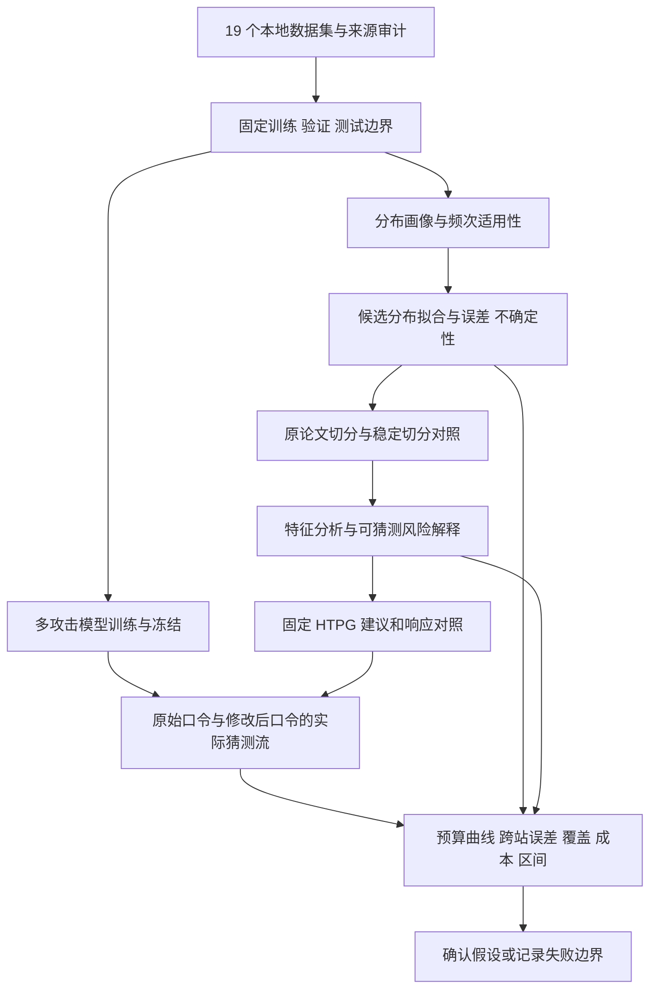

# ZipfGuard：19 数据集核验与下一阶段任务书

> 核验日期：2026-09-25。范围：当前工作区、现有报告、19 份本地数据的内容哈希、33 项定向测试、原始论文与作者资料。
>
> **本文件是最新实施主线。**按用户与老师的新要求，固定使用 MAYA 目录中的 19 个泄露口令集，重点研究**分布、拟合、分析、攻击、评价**。切分连接这些模块；修改建议保留为 HTPG 基线和固定下游应用。旧任务书中“优先创新建议组合”“先补齐 178/CSDN/RenRen 才能继续”的安排由本文件替代。
>
> 本文提出研究假设和待办，没有宣称新方法已经有效。全国密码竞赛的具体届次、截止时间与官方提交规则尚未核验；多篇论文支撑是用户的明确要求。

## 目录

1. 现在到底完成了什么
2. 19 个数据集的现状
3. 研究主线与各部分目标
4. 多攻击模型组合与 PassLLM 接入
5. 统一实验与评价协议
6. 可直接交给 Agent 的任务卡
7. 阶段验收和停止条件
8. 权威文献与证据映射
9. 关键文件索引与核验方法

---

## 1. 现在到底完成了什么

### 1.1 结论

**当前完成的是若干工程修复、数据下载与聚合分析、研究协议和缺口记录；真实数据上的完整多模型攻击评估、跨站确认实验和创新有效性证明仍未完成。**

现有 `AGENT_EXECUTION_STATUS.md` 本身就把 T04/T05 标为 incomplete，把 T06 标为“完成定义，未证实”。因此，不能把“这轮任务已交付”理解成“整个科研目标已完成”。

| 部分 | 当前证据 | 本次判定 |
| --- | --- | --- |
| 数据 | 19 份 payload 均存在；本次重新计算 SHA-256，均匹配 ready 文件和报告 | 文件到位；频次来源语义仍需分站核实 |
| 分布/拟合 | 缓存报告 18 站完成 `frequency > 3` 的 HTPG 拟合；1 站只有放宽阈值结果 | 聚合基线部分完成；不是 19 站统一模型选择实验 |
| 三模型比较 | 已有离散 Zipf、有限支持 CDF-Zipf、stretched-exponential，以及 MLE/BIC/留出集比较 | 已有代码基础；目前有 100,000 类别上限，不能直接覆盖多数全量语料 |
| 切分 | 已有 HTPG 曲率头尾划分 | 未完成跨样本规模、跨模型的稳定性验证 |
| 分析 | 15 站计算过九特征 IGR；4 站跳过 | 14 站主协议特征 + 1 站敏感性特征；尚非 19 站全部完成 |
| 修改 | 有提取器一致性检查、执行状态、论文兼容规则 | 可作为固定对照；没有真实可记忆性证据 |
| PCFG | 本地上游及适配器存在；本次相关小规模合成集测试通过 | 有可运行基础；不能代表 19 站真实数据攻击完成 |
| OMEN | 接口固定返回未接入、猜测数 0 | 未接入 |
| PassLLM | 存在能力占位文件；评测方法直接抛异常 | 未接入；当前配置路径的底座与 LoRA 目录缺失 |
| 其他神经攻击 | 当前未见已接入的 PassGPT/FLA/PassGAN 主评测链路 | 待实现和验收 |
| 评价 | 漏收保护、空指标渲染、不完整种子汇总等检查通过 | 正确性有所改善；主实验结果仍缺 |
| 新方法 | `htpg_optimization.py` 选择传入评分最低的可行项 | 没有真实评分驱动器，也没有优势证明 |

### 1.2 本次实际验证的范围

- 8 项：新增合同检查、发布保护、论文相等距离规则。
- 25 项：分布、MAYA 频次与外部分析、PCFG 适配、Markov 原始序号及部分响应检查。
- **共 33 项通过，没有跑完整测试集，也没有重跑全部 19 站的拟合和特征计算。**
- 本次验证了 19 份数据的内容哈希；表中的历史拟合、IGR 数值来自与这些数据对应的现有聚合报告。
- 当前配置使用的 Python 环境没有 `torch`、`transformers`、`peft`。这只描述本次检查的解释器，不代表机器上所有环境都不存在这些包。
- 独立核验记录：[progress_audit_2026-09-25_pipeline.json](/Users/cjx_main/Desktop/new/MMJS/ZipfGuard/reports/progress_audit_2026-09-25_pipeline.json)。

### 1.3 还需要修正的具体问题

1. **实验代码与报告版本脱节。**当前主协议是 `robustness-v4`；`directed_size900.json` 仍是 v2，多个报告是 v1。旧收益不得作为新代码的效果证据。
2. **发布逻辑没有完整进入指纹。**`robustness_manifest()` 的文件列表未覆盖新加的 `evaluation_validity.py`、自身及相关资源。修改评价规则可能不改变这个 source hash。
3. **外部分析缓存失效条件不完整。**缓存只检查 cache version、数据 hash、特征数量上限；未包含分析代码、词表和具体拟合配置。数据 hash 一致只证明输入身份，不证明缓存对应当前算法。
4. **大数据处理仍有限制。**特征分析超过 7,000,000 类别就跳过；分布比较入口上限是 100,000 类别。读取文件头时使用 `read_bytes()[:16]` 还会先读整个文件。
5. **已有分布模型选择实现与注释不完全一致。**BIC 前两名差小于 10 时，代码在全部模型中选择预算点误差最小者，没有把候选限制到 BIC 接近最优的子集。下一轮先明确规则，再修正实现。
6. **消融标签仍需核对。**`no_igr` 实际是固定 Length/LSD 对照；`run_ablation()` 仍用“一次关闭一个开关”描述所有行。固定策略对照与单模块消融应分别命名。
7. **旧优化器不是当前研究主线。**它的 `feature_programs()` 注释称 ordered pairs，实际使用 combinations，未枚举两个执行顺序。修改动作通常不交换，若以后使用要修正；本阶段不扩大这条研究支线。

这些是明确代码位置上的问题，不是对未知风险的泛泛推测。文件索引见第 9 节。

---

## 2. 19 个数据集的现状

### 2.1 本轮范围

采用 MAYA 作者仓库公开列出的 19 个数据集。MAYA 的下载目录与论文实际采用的实验子集需要区分，不能声称其论文已经替我们验证了这 19 份文件的所有性质。[MAYA 作者仓库](https://github.com/williamcorrias/MAYA-Password-Benchmarking)

现有报告中，“出现次数”是当前文件解析后的记录频次。**在上游格式化和去重过程核实前，不统一改称独立用户数或真实账户频次。**

| 数据集 | 出现次数 | 独特字符串 | HTPG 拟合 | 特征分析 |
| --- | ---: | ---: | --- | --- |
| rockyou | 32,602,874 | 14,314,551 | 主协议完成 | 规模上限跳过 |
| myspace | 41,545 | 37,124 | 主协议完成 | 已计算 |
| phpbb | 255,420 | 184,358 | 主协议完成 | 已计算 |
| linkedin | 60,650,662 | 60,591,405 | 主协议完成 | 规模上限跳过 |
| hotmail | 9,813 | 8,924 | 主协议完成 | 已计算 |
| mailru | 3,723,513 | 2,260,489 | 主协议完成 | 已计算 |
| yandex | 1,261,809 | 717,202 | 主协议完成 | 已计算 |
| yahoo | 442,838 | 342,479 | 主协议完成 | 已计算 |
| faithwriters | 9,709 | 8,347 | 主协议完成 | 已计算 |
| hak5 | 2,984 | 2,351 | 主协议完成 | 已计算 |
| 000webhost | 15,270,702 | 10,588,510 | 主协议完成 | 规模上限跳过 |
| singles | 16,248 | 12,233 | 主协议完成 | 已计算 |
| gmail | 4,926,671 | 3,135,384 | 主协议完成 | 已计算 |
| zomato | 5,870,749 | 4,989,070 | 主协议完成 | 已计算 |
| taobao | 7,492,029 | 6,165,938 | 主协议完成 | 已计算 |
| mate1 | 27,402,201 | 11,957,093 | 主协议完成 | 规模上限跳过 |
| twitter | 39,518 | 35,137 | 主协议完成 | 已计算 |
| ashleymadison | 375,853 | 375,745 | 仅敏感性 | 已计算 |
| libero | 667,635 | 418,360 | 主协议完成 | 已计算 |

表中“主”指 `frequency > 3`；“敏感性”指主协议失败后使用 `frequency > 0`。跳过不等于运行失败，拟合成功也不等于统计模型充分适合。

### 2.2 两个必须先解释的异常

- LinkedIn：60,650,662 次出现、60,591,405 个不同字符串，重复比例约 0.098%；拟合 α 约 0.108，头部切到第 1 名。
- Ashley Madison：375,853 次出现、375,745 个不同字符串，重复比例约 0.029%；高于 3 次的类别不足，原阈值拟合失败。

这些观测提示它们可能受去重、筛选或泄露样本机制影响，但**仅凭这些数字不能断言原人群口令分布接近均匀，也不能断言所有重复都是噪声**。先核对作者下载脚本、格式化代码和上游说明，再标注“频次可解释”“只适合独特字符串评估”“语义待确认”。

19 个数据集继续保留在总清单。某站缺乏可靠频次时，可参与生成覆盖和独特字符串分析；其账户风险、Zipf 频次结论标为不适用，并报告实际有效站点数。

### 2.3 为什么可以沿用原论文场景

保留原论文的逻辑：**真实口令分布 → 头尾结构 → 特征分析 → 固定 HTPG 响应 → 修改前后攻击评价**。把实验语料明确替换为 19 个 MAYA 数据集，把攻击器扩大为多模型。这属于 HTPG 方法的迁移复现与扩展。

原论文六站点和图表的精确数值复现单独列为历史未完成项；不再要求补齐 178/CSDN/RenRen 才能开展当前研究，也不能把其他数据改名为这些站点。[HTPG 原论文](https://doi.org/10.1109/TIFS.2022.3152357)

---

## 3. 研究主线与各部分目标

### 3.1 建议的总课题

**在 HTPG 场景下，研究分布估计与头尾分析能否更准确、稳定地反映多种攻击模型下的有限预算口令风险。**

五个重点可以连接成一个研究问题，不必各自包装成一项独立创新：

- 主贡献候选 A：样本规模敏感性分析，以及经过攻击风险验证的稳定分布拟合与切分。
- 主贡献候选 B：利用分布与结构信息，校准多模型风险，或在固定总预算下分配多模型猜测资源。
- 支撑贡献：跨站特征解释、19 站统一实验、模型能力边界与不确定性评价。

“换一个分布”“使用 MLE”“接入 PassLLM”“把几个模型结果取并集”都有前人工作，单独做这些不能算已建立创新。是否有新增方法贡献，要靠相关工作比较和冻结测试来判断。



图中的“固定训练/验证/测试”是数据隔离；用户所说的“切分”主要是 Head/Tail 划分。两者需要分别命名。

### 3.2 数据：把 19 份文件变成可解释的基准

**目标：每一条分布、拟合和攻击结果都能追溯到确切版本、处理规则和适用人群。**

步骤：

1. 建立 19 张数据卡，写明来源仓库 commit、下载地址标识、文件哈希、格式、编码、频次含义、过滤规则。
2. 逐站记录原始行数、有效记录、独特字符串数、重复率、单次出现比例、长度/字符集分布、丢弃原因。
3. 明确记录 MAYA 上游做过的格式化、去重和长度限制。无法证明的字段写 unknown。
4. 保留原始字符串的大小写、空格与字符差异；不要为方便模型而静默小写、截断或删除非 ASCII。
5. 区分 occurrence 加权和 unique 加权。统计分母与数据能力匹配。
6. 训练/验证/测试按固定种子生成；记录跨站相同字符串的交集统计，不导出口令明文。
7. 已知公共模型训练过某站时，标记 pretraining exposure。微调时未使用测试集，并不能消除底座或旧 checkpoint 的历史暴露。

验收：19/19 数据卡；19/19 输入哈希；每站能力标记；所有实验 manifest 能指向 split 和预处理版本。**下载完成不是数据验收完成。**

依据：MAYA 的标准化实验设计；Bonneau 的分布与猜测指标研究。[MAYA](https://arxiv.org/abs/2504.16651)、[The Science of Guessing](https://www.ieee-security.org/TC/SP2012/papers/4681a538.pdf)

承接：数据口径明确后，分布形状才有可比较的含义。

### 3.3 分布：确定在哪些站点、哪些区域适合何种描述

**目标：形成跨站分布画像，找到原模型稳定成立和明显失配的区域。**

先完成：

- 每站画 rank-frequency、rank-CDF、频次直方图；注明坐标与权重。
- 统计 Top-10/100/1000 的经验质量、单次出现质量、长度和 LSD 结构集中度。
- 在同一站点做固定随机抽样规模的曲线比较；样本规模与支持集变化分别记录。
- 比较原始频次与 unique 视图，展示去重造成的差异。unique 列表不能反推原账户分布。
- 19 站分别展示；同时提供站点宏平均与记录量加权汇总，避免大站掩盖小站。

研究目标：检验“单一分布是否足以覆盖头、中、尾部”，以及“样本量/预处理变化是否被误解释成人群行为变化”。候选是已有三模型；只有残差和留出集结果支持时才增加分段或混合模型。

验收：19 站描述表；频次语义合格站点的可比曲线；异常站点说明；按预先规则选出的候选模型集合。不能预先规定每站必须更符合某模型。

依据：Wang 等研究口令 Zipf 规律；Hou 与 Wang 进一步比较替代分布与拟合偏差。因此 stretched-exponential 本身已是相关工作。[Zipf’s Law in Passwords](https://eprint.iacr.org/2014/631)、[New Observations](https://wangdingg.weebly.com/uploads/2/0/3/6/20366987/tifs22-n2-final.pdf)

承接：本环节给出需要解释的形状和误差区域；拟合环节负责估计参数并检验预测效果。

### 3.4 拟合：从“曲线看起来像”走向可验证的风险估计

**目标：在独立留出数据上，给出稳定的参数、明确的模型误差和有限预算风险估计。**

必须保留的基线：

1. HTPG：高于 3 次的频数，log-log OLS，原公式曲率。
2. 当前项目的离散 Zipf MLE。
3. 当前有限支持 CDF-Zipf MLE。
4. 当前 stretched-exponential MLE。
5. 简单经验频次基线，用来检验复杂拟合是否真的有增益。

执行要求：

- 参数和排序仅由训练数据确定。验证集选择模型与超参；最终测试集不参与选择。
- 区分 log 残差 R²、CDF 误差、预测 log-likelihood 和真实攻击成功率，不能互相代替。
- 所有 likelihood 比较使用同一支持、同一观测单位、同一截断与条件化规则；不能直接拿不同样本范围的 BIC 比大小。
- 论文 OLS 截去了低频部分；若比较全量预测，必须定义完整归一化与尾部处理，不能默认已有合法全量概率模型。
- 对训练未见字符串，单独统计留出质量；需要时使用明确定义的 OTHER 桶。一个 OTHER 概率不是每个未见口令的生成概率。
- 样本规模、阈值、优化器、多起点、bootstrap 都写入配置。大规模 bootstrap 采用分批重采样，不构造“重复次数 × 六千万类别”的稠密矩阵。

核心评价：独立测试 NLL/CDF 误差、预算点误差、重采样参数区间、优化失败率、时间和峰值内存。经验 Top-B 质量表示已知分布最优排序的参考；PCFG/LLM 的实际猜测风险还要由第 4 节实测。

候选创新：在相关模型竞争基础上，研究**以攻击风险误差为目标的跨站校准或受约束模型选择**。先证明它比现有验证集规则和经验基线更稳定，再称为贡献。

依据：统计拟合的通用框架及口令分布的专门研究。Clauset 等的幂律变量建模与本项目“秩上的多项分布”并非同一个统计模型，借鉴检验原则时必须明确适配，不能机械套用其估计公式。[Power-law Distributions](https://arxiv.org/abs/0706.1062)、[New Observations](https://wangdingg.weebly.com/uploads/2/0/3/6/20366987/tifs22-n2-final.pdf)

承接：参数区间和模型误差应传递到头尾切分，避免输出一个看似精确却不稳定的整数。

### 3.5 切分：让头尾划分具有稳定、可解释的意义

**目标：明确 Head/Tail 是频次结构标签，并检验它与各类攻击风险的关系。尾部不自动等于安全。**

本次受控检查发现：`f(r)=C/r^alpha` 的原始坐标曲率峰满足

```text
x0 = [C²·alpha²·(2alpha+1)/(alpha+2)]^[1/(2alpha+2)]
把计数整体乘以 k，且拟合类别不变时：
x0' = k^[1/(alpha+1)] · x0
```

用 1,000 类、`round(100000/r)` 的人工频数检查，α 基本不变，计数乘以 10 后 cutoff 从 316 变为 999。这是可复查的数学/实现性质，**不是已证明原论文错误，也不是新方法在真实数据上获胜**。原公式依赖坐标尺度；首先应解释它想识别的是几何结构还是固定概率风险。

下一步对照：

- 原始 HTPG 曲率阈值。
- 固定累计质量阈值，q 在验证阶段确定。
- 拟合模型导出的累计质量阈值。
- 带不确定区间的阈值：稳定头部、边界不确定区、稳定尾部。

测试：整体倍数、随机下采样、低频截断、并列频次、头部只有 1 个类别、曲率落在支持集外。倍数检查可以条件于固定支持；真实下采样必须承认未观测类别发生变化。

验收：阈值区间、头部记录质量、成员稳定率、对应多模型攻击风险和误判情况。新增切分法应在稳定性和实际风险区分能力之间作比较。

依据：HTPG 的曲率定义提供直接基线；分布风险指标提供可比较的替代含义。[HTPG](https://doi.org/10.1109/TIFS.2022.3152357)、[Bonneau](https://www.ieee-security.org/TC/SP2012/papers/4681a538.pdf)

承接：标签稳定以后，才能解释哪些特征在区分头尾；攻击标签又可以检验这种区分是否有安全意义。

### 3.6 分析：解释“容易被哪种模型猜中”，并检查跨站泛化

**目标：把原来的 IGR 头尾特征排序扩展成经过实际攻击检验的风险解释。**

分两条输出：

1. **结构解释**：特征与 Head/Tail 标签的关联，保留原论文九特征、unique 主视图与频次敏感性视图。
2. **风险解释**：特征与某攻击器在预算 B 内命中的关联。实际命中标签来自冻结攻击流，不能反馈给主实验猜测器。

工作项：

- 为 4 个大站补足可扩展的聚合分析；若只能抽样，明确抽样方案和误差，不能填成全量分析。
- 核对英文词表在中文、俄文、意大利文等数据上的覆盖。目录语言只是元数据，不直接推断每条口令或用户语言。
- 报告词表来源、版本、缺失覆盖率；多语言词表不能在测试口令上临时构建后再评价。
- Length 与 LSD 等相关特征做分组消融/条件比较，避免把同一信息重复归功。
- 比较 IGR 排序、简单风险基线、可解释风险模型的跨站表现；模型复杂度受站点数量约束。
- 输出站点 × 特征 × 攻击器 × 预算的聚合风险表，包含样本量和区间。
- 做头尾边界变化的敏感性，避免“标签变了所以 IGR 变了”被当作真实行为差异。

候选创新：**跨站、跨攻击器仍稳定的风险特征与条件化解释**。仅证明某特征与头部相关，不能推出强制修改它会提高安全性；关联、预测和干预效果分开陈述。

验收：能解释哪类口令被哪个模型覆盖、哪些特征结论只在本站成立、哪些语言/长度群体评估不足。使用固定评估模型时报告校准误差和分组覆盖；解释质量不是只看图是否好看。

依据：HTPG 九特征为基线；多攻击器偏差研究说明结论受模型族与配置影响。[HTPG](https://doi.org/10.1109/TIFS.2022.3152357)、[Ur 等](https://www.usenix.org/conference/usenixsecurity15/technical-sessions/presentation/ur)

承接：分析输出支撑固定修改对照和风险预测；不在这一阶段不断增加建议模板。

### 3.7 修改：作为稳定的应用验证层

**目标：保持原场景完整，并控制修改执行器对上游方法比较的干扰。**

- 固定 `paper_compatible` HTPG、不修改、固定长度/LSD 对照。
- 所有上游拟合/分析方案共用同一动作空间、执行器和采用率。
- 至少区分确定性与多样化响应；记录成功、无需修改、无法执行、冲突、拒绝。
- 同时报告修改比例和字符编辑成本；不同方法的安全收益需要与实际成本一起看。
- 用户拒绝时保留原记录；不把拒绝者从分母删除。
- 固定攻击器与适应修改后分布的攻击器分开评价。适应训练只能使用修改后的训练数据。
- 不宣称自动变长就更安全、不把未命中等同不可破解、不沿用原论文可记忆率。

验收：同输入可追溯、输出满足动作语义、无数据删失、修改前后能公平匹配。该部分本阶段以工程正确性为目标。

依据：HTPG 定义原流程；动态策略研究提示需要考虑响应诱导的集中模式，但其用户研究结论不能迁移为本项目实测。[HTPG](https://doi.org/10.1109/TIFS.2022.3152357)、[Diversify to Survive](https://www.usenix.org/conference/soups2017/technical-sessions/presentation/segreti)

承接：修改后的口令需要交给具备相应长度和字符能力的真实攻击器评估。

### 3.8 攻击：建立多模型实测，再研究如何组合

**目标：覆盖统计、语法、Markov、神经和大模型等不同归纳偏好，保留真实生成顺序与成本。**

具体模型、接入步骤与验收见第 4 节。首个完整版本建议至少包含：训练频次字典、PCFG、作者 OMEN、PassGPT、PassLLM trawling；FLA 作为独立神经族补充，PassGAN/PassFlow 为扩展对照。

“模型名称出现在 UI”不算完成。至少需要：来源版本 → 训练/权重身份 → 实际生成 → 预算计数 → 测试命中 → 可复跑报告。

候选创新是**分布特征驱动的模型预算分配**，比较固定轮转、按验证效果固定配额等基线。MAYA 已研究多模型组合，因此“组合多个模型”本身不构成新增贡献。

依据：[PCFG 原论文](https://conferences.computer.org/sp/pdfs/sp/2009/oakland2009-23.pdf)、[OMEN 作者代码](https://github.com/RUB-SysSec/OMEN)、[PassGPT](https://arxiv.org/abs/2306.01545)、[PassLLM](https://www.usenix.org/conference/usenixsecurity25/presentation/zou-yunkai)、[MAYA](https://arxiv.org/abs/2504.16651)

承接：攻击流提供实验观测，评价环节负责说明这些结果能支持多大范围的结论。

### 3.9 评价：从单个命中率升级为可审计的风险测量

**目标：解释模型误差、攻击偏差、预算成本和结论不确定性，防止“模型够不到”被误算成安全提升。**

必须输出：

- 各模型、各预算、各站点的 Cracked@B，而非只输出最强模型或一个平均数。
- occurrence 加权与 unique 命中率，明确哪个可解释为账户风险。
- 原始生成数、有效生成数、去重后猜测数、重复率、域内覆盖率、耗时和峰值内存。
- 原始/修改后、frozen/adaptive 分开；未完成的预算格子写 censored/incomplete，不填 0。
- 风险估计值与实测值的偏差、方向及区间；出现系统性低估时，给出适用域限制。
- 站点宏平均为跨站主要汇总，记录量加权值为补充；保留最差站点和全部失败记录。
- 训练随机性与测试抽样不确定性分开。多个种子并不创造新的独立站点。

候选创新：**带模型能力边界和跨模型偏差校准的风险报告方法**。与普通命中率统计相比，必须展示它确实改善风险估计或发现传统评价遗漏的失效情形。

依据：[Ur 等](https://www.usenix.org/conference/usenixsecurity15/technical-sessions/presentation/ur)、[MAYA](https://arxiv.org/abs/2504.16651)、[Bonneau](https://www.ieee-security.org/TC/SP2012/papers/4681a538.pdf)

---

## 4. 多攻击模型组合与 PassLLM 接入

### 4.1 模型分层

| 模型 | 实验角色 | 当前状态 | 下一验收点 |
| --- | --- | --- | --- |
| 训练频次字典 | 低预算经验基线 | 已有 | 真实数据开放词典顺序，禁止用测试频率排序 |
| PCFG | 结构语法基线 | 可运行，但主要围绕合成候选接口 | 流式原始生成，不经公共候选过滤后重新编号 |
| OMEN | 原论文 Markov 基线 | 状态占位 | 作者程序、固定参数、无测试成功反馈的生成流 |
| FLA/RNN | 字符神经基线 | 待接入 | 独立训练/权重身份、生成或明确标注的排名估计 |
| PassGPT | Transformer 密码模型 | 待接入 | 作者实现、tokenizer/长度域、冻结权重、实际猜测流 |
| PassLLM trawling | LoRA/蒸馏 LLM 批量猜测 | 能力占位；当前配置模型文件缺失 | 作者 artifact、底座与 LoRA 配对、真实生成评测 |
| PassGAN 或 PassFlow | 不同生成族补充 | 待接入 | 优先参考 MAYA 实现，验证标准化适配与限制 |

首轮并行推进传统攻击组和神经/LLM 组。先把一个共同小预算打通，再扩大预算；不需要等所有模型都能生成 1e8 才开始分析。

FLA 的权威来源是 USENIX Security 2016；PassGAN 为生成族对照而非保证更强的模型。[FLA](https://www.usenix.org/conference/usenixsecurity16/technical-sessions/presentation/melicher)、[PassGAN 原论文](https://arxiv.org/abs/1709.00440)

### 4.2 PassLLM 的正确接法

1. 从 [USENIX 论文](https://www.usenix.org/conference/usenixsecurity25/presentation/zou-yunkai) 的 Open science 指向 [作者 Zenodo 归档](https://zenodo.org/records/15612295)，记录 artifact DOI、校验值、版本和使用条件。
2. 先核对归档 README、checkpoint 配置与训练来源。作者归档包含代码和两个 checkpoint；归档大小不等于完整底座大小或运行显存。
3. 当前项目路径暗示 RockYou LoRA + 0.5B 底座，但这不是已安装证据。按模型配置获取匹配底座/tokenizer，不根据目录名猜测版本。
4. 本项目主任务使用 **trawling**：没有目标个人信息的批量猜测。19 份口令文件不自动提供 PII 或同一人的 sister password，故不直接复现 PassLLM-I/II/III 的定向结论。
5. 先做 1,000–10,000 条实际生成的兼容性试跑，记录生成时间、显存/内存、无效输出、重复率和退出状态；再决定 1e5/1e6 预算。
6. 区分两阶段实际生成和 Monte Carlo 猜测数估计。估计曲线不能写成实际生成了 1e8 或 1e15 条猜测。
7. 公共 RockYou checkpoint 用于模型接入验证和有暴露说明的迁移轨道。干净确认轨道应使用可核验训练清单/自行划分训练，仍披露通用预训练数据不可完全审计的限制。
8. 把状态改成条件判断：只有实际加载、生成、评价和产物都成功才标 integrated/participated。缺文件/依赖/算力要返回具体状态，不能静默退回 Markov 后仍显示 PassLLM。

论文报告的收益是论文特定数据、基线和场景下的结果；不能复制为 ZipfGuard 的收益承诺。

### 4.3 PassGPT 的长度限制是一个具体评价风险

作者公开的 10 字符模型与需要研究批准的 16 字符模型适用范围不同，公开版本还注明相对论文做过整理优化。[PassGPT 作者仓库](https://github.com/javirandor/passgpt)

若修改器把口令变成 14 字符，10 字符模型猜不到不能单独证明防御有效。因此：

- 报告模型可生成的长度/字符域及测试域外比例。
- 主比较需要能够覆盖修改后输入域的攻击模型。
- 同时输出统一公共域内结果和全体样本结果，域外样本保留在总体分母并标注能力限制。
- 不截断目标口令、不悄悄删除模型不支持的样本、不把概率零或未命中说成无穷强度。

### 4.4 攻击接口合同

建议引入独立的流式接口，避免继续把开放生成塞进封闭候选排序接口：

```text
prepare(training_manifest, model_config) -> frozen_model_manifest
generate(frozen_model_manifest, generation_limits) -> ordered stream
evaluate(ordered stream, heldout_target_view, budget_grid) -> aggregate metrics
```

模型 manifest 至少包含：实现来源/hash、模型/tokenizer/adapter hash、训练与验证 split、长度与字符域、生成算法/温度/beam 等参数、随机种子、实际完成预算、硬件与时间。

生成器只接收允许的训练信息；目标测试集仅进入 evaluator。使用目标反馈的动态攻击属于独立命名的实验，不混入无反馈主表。

### 4.5 固定总预算的组合研究

三种量分别报告：

1. `max_a Cracked_a(B)`：各单模型在预算 B 下的最好值，属于比较摘要。
2. `union_a G_a(B)`：各模型各跑 B 后的并集，原始预算可达模型数乘 B。
3. `union_a G_a(b_a), sum(b_a) <= B`：真正固定总预算的组合。

研究候选：训练/验证阶段利用站点分布摘要与模型互补覆盖，确定各模型配额；测试时执行冻结配额。对比等额轮转、验证集最佳单模型、固定经验配额、验证集贪心配额。禁止观察测试命中率后再选择比例。

先做不依赖目标分布的迁移轨道；如使用目标站的已授权历史样本估计分布，应明确这是额外信息轨道，对所有对照提供相同信息。

MAYA 已包含模型互补和组合实验。本项目必须检验“分布条件化 + 预算约束”的增量，而非只再实现一次并集。

---

## 5. 统一实验与评价协议

### 5.1 三条轨道

| 轨道 | 用途 | 必须满足 |
| --- | --- | --- |
| L0 小规模回归 | 接口、计数、泄漏保护、语义正确性 | 合成数据；不形成参赛性能主结论 |
| L1 真实语料基线 | 19 站描述及多模型风险 | 数据能力分层，实际生成预算，公开逐站结果 |
| L2 冻结方法确认 | 判断改进是否成立 | 验证阶段选方法，未用于调参的站点/测试部分评估 |

当前已有聚合描述被查看过，应如实记录；仍可把尚未用于选择新方法的攻击测试数据作为冻结确认部分。不要把已经反复调过的结果称盲测。

### 5.2 划分与迁移

- 同站实验默认 60/20/20 occurrence 划分，独特字符串仍可能自然重复；这模拟同一分布采样，需要明确“允许相同口令值出现”。
- 另设 unique-disjoint 敏感性：同一字符串只能进入一个划分，用于未见字符串泛化；不能把它与 occurrence 采样估计的账户风险混为一谈。
- 跨站 A→B 保留真实站点交集并报告 seen/unseen 分项。不要无声明地去掉交集，因为去重改变问题。
- 对公共 checkpoint 的历史训练暴露单独标注，不能只靠本轮 split hash 排除。
- 全部有向站点配对是 19×18=342；不要求首轮对所有大模型全部重训练。先预注册覆盖不同规模/分布的配对，复用同一来源模型的攻击流评估多个目标，之后扩大。
- 如果采用站点层调参，可在查看新方法攻击结果前固定 10/4/5 的开发/验证/确认分组，并按合格数据能力校正实验可用数量。小站统计不稳定要报告，不静默排除。

### 5.3 预算与成本

- 调试档：1e3、1e4；第一轮共同实际生成档：1e5，条件允许扩到 1e6。
- 1e7/1e8 是后续扩展目标；只在有生成日志与结果时写完成。
- 同时记录 raw emissions、合法候选、unique candidates、实际校验数。重复生成消耗生成资源；若校验前去重，则校验预算和生成预算分开。
- 同生成预算用于复现采样行为；同 unique 校验预算用于比较攻击覆盖；同时间/硬件成本作为另一张表，不能只选最有利口径。
- 大模型还要计入训练、加载、tokenization、生成、排序、去重成本，避免只报告最快片段。

### 5.4 统计与发布

- 先固定 1–2 个主要研究假设和主要指标，其他曲线是探索性结果。
- 按站点报告 paired 差值；确认区间优先在站点层或分层重采样，不把同一站点的几百万记录当成几百万个独立站点。
- 随机生成模型的重复运行用于估计生成随机性；deterministic 基线不靠重复相同结果制造样本量。
- 所有方法比较使用相同目标记录、预处理、预算、响应、模型能力域。
- 缺失、超时、OOM、模型域外、阈值失败分别标注；预先固定如何汇总，不能删除失败行后仍称完整实验平均。
- 所有图表关联 machine-readable JSON、配置 hash、数据/split/model/source hash 和生成命令。
- 明文口令留在本地受控实验输入；共享报告只保留聚合统计和可复跑指纹。

---

## 6. 可直接交给 Agent 的任务卡

### 通用交付规则

每张任务卡分别报告：`implemented`、`tested`、`experiment_completed`、`claim_supported`。四者不能合并成一个 done。后续路径为**建议新建产物**；没有实际生成前不得在状态表链接成“已有结果”。

### A00｜统一范围、冻结证据

- 输入：本文件、当前源码、旧报告。
- 操作：在旧任务入口标明本文件优先；建立 19 站实验配置；归档 v1/v2 结果并加版本警示；补齐源码、资源、配置、词表指纹。
- 修复缓存：将数据 hash + 分析 source hash + 词表 hash + 完整配置纳入 cache key；改变任一项必须失效。
- 交付：`configs/research19/protocol.json`、新的实验 manifest schema、缓存回归记录。
- 验收：修改评价逻辑/词表能改变指纹；旧结果不能自动显示为新方法结果。
- 依赖：无。研究算法代码不在这一步改动。

### A01｜19 站数据卡与频次审计

- 输入：19 个 ready/payload、MAYA 对应版本的预处理脚本。
- 操作：逐站确认格式化与去重、完成第 3.2 节字段、标注频次用途；专门解释 LinkedIn/Ashley Madison 异常。
- 交付：`docs/DATASET_CARDS_19.md`、`reports/research19/data_audit.json`。
- 验收：19/19 都有卡；unknown 有明确原因；所有计数可追溯；无伪造账户分母。
- 依赖：A00。此步骤默认复用现有数据，不重复下载。

### A02｜拆分、开放流与统一预算合同

- 输入：A01、现有 metrics/attackers。
- 操作：生成固定 split；分离 generator 与 evaluator；实现 raw/unique/time 三套账；设计流式匹配和中断恢复。
- 交付：`core/attack_stream.py`、split manifest、计数合同测试。
- 验收：重复猜测、无效输出、生成中断、空流、未知字符串、域外字符都能准确计数；测试数据未进入生成器。
- 依赖：A01。与 A03 的数学诊断可并行。

### A03｜分布画像与尺度诊断

- 输入：A01 聚合频数。
- 操作：逐站画像；固定样本量曲线；原始倍数与随机下采样分开；记录 α、C、cutoff、头部质量。
- 交付：`experiments/distribution_diagnostics.py`、`reports/research19/distribution_diagnostics.json`、尺度/残差图。
- 验收：19 站有结果或适用性说明；倍数检查可复现；所有数值图由 JSON 生成。
- 依赖：A01。先发现需要优化的问题，暂不增加复杂模型。

### A04｜可扩展拟合与独立模型选择

- 输入：A03、现有三模型代码。
- 操作：解除演示限制前先减少内存副本和 bootstrap 峰值；保留原 OLS；统一支持与截断；修正 BIC 候选选择范围；用验证数据选规则。
- 交付：`experiments/fit_benchmark.py`、拟合配置、逐站误差和资源表。
- 验收：同观测口径下的基线比较；有独立测试；数值稳定；不把截断结果冒充全量拟合。
- 依赖：A01/A03。候选分段模型仅在残差诊断和验证阶段支持后加入。

### A05｜头尾阈值与不确定性

- 输入：A04 参数与重采样结果。
- 操作：实现原曲率、经验质量、模型质量、区间边界对照；固定 tie 规则；传播模型选择不确定性或明确其条件性。
- 交付：`experiments/split_stability.py`、阈值与成员稳定性表。
- 验收：倍数、抽样、并列、退化边界齐全；能说明为何某站不宜使用二元 Head/Tail。
- 依赖：A04。真实风险检验等 A08/A09 提供攻击标签。

### A06｜跨站特征与风险解释

- 输入：A05，已有 IGR 和固定词表。
- 操作：补四大站聚合能力；记录多语言缺失；完成头尾关联；待攻击标签就绪后完成风险关联与可解释校准。
- 交付：`reports/research19/feature_stability.json`、特征/模型/预算风险表、分组消融。
- 验收：没有把未覆盖语言标成“没有该特征”；没有把相关性写成因果；所有确认预测来自外层留出。
- 依赖：A05；风险解释部分依赖 A08/A09。

### A07｜PCFG 与 OMEN 真实语料管线

- 输入：A02 与作者实现。
- 操作：PCFG 改成可流式消费的开放输出；保留原生成序号；把 1e6 硬上限改成显式资源配置需同时完成停止/计数机制。接入作者 OMEN 无反馈模式。
- 交付：真实数据训练 manifest、两模型小预算结果、上游版本与模式记录。
- 验收：至少一个预注册 A→B 配对的完整运行；不借用合成候选字典；实际输出数与预算一致；未使用目标成功反馈。
- 依赖：A02。不要把原固定阶 Markov 改名为 OMEN。

### A08｜PassGPT 与 PassLLM

- 输入：A02、作者代码/模型材料、实际硬件清单。
- 操作：按第 4.2 节完成 PassLLM；按作者仓库完成 PassGPT；建立模型能力卡与训练暴露标记。
- 交付：两个真实 adapter、模型配置/权重指纹、试跑资源表、第一档真实数据命中曲线。
- 验收：实际加载→生成→计数→评价链路通过；不靠 capability status 冒充接入；所有长度限制出现在报告。
- 依赖：A02。先试跑测资源，再确定训练和大预算；没有 GPU 时先做可承担的小模型/CPU 档并诚实记录。

### A09｜多模型基线矩阵

- 输入：A07/A08；条件允许增加 FLA、PassGAN/PassFlow。
- 操作：固定训练规模、目标数据、预算和域；生成一份攻击流支持多个预算截点及多个目标站点；给出互补覆盖分析。
- 交付：`reports/research19/attack_matrix.json`、模型能力表、逐站曲线。
- 验收：首个主表至少包含频次、PCFG、OMEN、PassGPT、PassLLM；未完成模型单列，不算入“已完成多模型”。
- 依赖：A07/A08。接口可以并行开发，主表必须统一评价。

### A10｜验证研究假设，选择最多两个主方向

- 输入：A03–A09 的开发/验证结果。
- 操作：从尺度稳定切分、风险校准、分布条件化预算配额中选最多两个；写明确目标函数、输入信息、基线和停止标准；冻结选择。
- 交付：`docs/RESEARCH_HYPOTHESES.md`、方法配置、验证阶段实验日志。
- 验收：有明确可被否定的假设；新方法优势不是使用了额外测试信息或额外总预算；相关工作包括 MAYA 已有组合实验。
- 依赖：A09。不以五个方面都声称创新为验收条件。

### A11｜固定修改层与确认实验

- 输入：冻结方法、固定 HTPG/执行器、多模型攻击配置。
- 操作：在固定站点/测试部分跑原始和修改后、frozen/adaptive；做公平消融、模型能力域检查、成本匹配与区间。
- 交付：`reports/research19/confirmation.json`、所有失败和缺失单元、最终实验表。
- 验收：不按测试结果更改方案；有提升就报告适用范围，无提升就记录失败；不能通过更换后缀/删除样本掩盖失败。
- 依赖：A10。这是有效性确认步骤，不能由文档存在性测试代替。

### A12｜参赛研究报告与一键复跑

- 输入：A11、证据清单、文献表。
- 操作：写清原论文基线、迁移设置、研究问题、方法、全量结果、成本、限制；每项结果指向实际产物。更新状态与图表，提供小预算现场复跑。
- 交付：技术报告、图表、references.bib、执行入口、逐任务验收表。
- 验收：同一输入和配置能复跑；图表与 JSON 一致；任何“提高 X%”都能核对分母、对照、预算与区间；不存在未运行却写完成的格子。
- 依赖：A11。提交材料的格式另按比赛官方要求核对。

### 推荐并行安排

```text
A00 → A01 → A02 → A07 ┐
             └→ A08 ─┼→ A09 → A10 → A11 → A12
A01 → A03 → A04 → A05 → A06 ┘
```

分布/拟合组、攻击组、评价与数据组可以并行。各组必须共用 A01/A02 的数据和指标合同。

---

## 7. 阶段验收和停止条件

### 第一里程碑：数据与模型真的跑通

- 19 张数据卡和适用性分类。
- 发布规则、缓存、指纹修复。
- 真实数据开放流评价打通。
- PCFG/OMEN/PassGPT/PassLLM 有真实小预算结果；缺失模型有具体原因。
- 当前三模型与 HTPG 的逐站基线清楚。

### 第二里程碑：问题有实测依据

- 量化尺度敏感、分布失配、特征漂移、攻击互补和模型域外盲点。
- 每个拟研究问题都有基线、失败案例和可验证改进目标。
- 选最多两个主创新候选，其他模块作为支撑。

### 第三里程碑：确认是否成立

- 冻结测试支持的误差下降/攻击资源收益/风险解释改善。
- 同预算同信息对照与消融结果。
- 跨站区间和失效范围。
- 原场景固定修改层没有推翻主要结论，或明确报告其限制。

### 判定规则

工程完成要求接口、测试和实际产物齐全；科研假设成立要求独立确认数据支持。可以在开发阶段登记实用收益门槛，但它是项目选择，不冒充论文或竞赛规定。

出现以下情况应收缩主张：

- 改进只在训练/验证集成立。
- 只提高拟合 R²，没有改善风险估计或稳定性。
- 只对长度受限模型显示防御提升。
- 组合模型耗费更多总预算才赢。
- 优势只出现在个别站点，且整体区间不支持推广。
- 结果依赖无法解释的去重/频次语料。

失败不要求继续堆模型或修改模板。可以交付严格复现、适用性分析和有证据的负结果，再决定是否扩大研究。

---

## 8. 权威文献与证据映射

文献支持问题定义、基线和评估方法；本项目的效果由自己的冻结实验支持。下面没有将他人论文数值复制成项目预期收益。

| ID | 原始来源 | 支持的部分 | 使用边界 |
| --- | --- | --- | --- |
| P1 | Yang Xiao, Jianping Zeng. *Dynamically Generate Password Policy via Zipf Distribution*. IEEE TIFS 17, 2022. [DOI](https://doi.org/10.1109/TIFS.2022.3152357) | 原始场景、切分、IGR、修改对照 | 19 站扩展不称原六站全部复现 |
| P2 | Ding Wang et al. *Zipf’s Law in Passwords*. IEEE TIFS 12(11), 2017. [作者 ePrint](https://eprint.iacr.org/2014/631) | 口令分布基线 | 不能假设每份去重文件代表原账户分布 |
| P3 | Zhenduo Hou, Ding Wang. *New Observations on Zipf’s Law in Passwords*. IEEE TIFS 18, 2023. [作者全文](https://wangdingg.weebly.com/uploads/2/0/3/6/20366987/tifs22-n2-final.pdf) | 替代分布、拟合误差与样本量问题 | stretched-exponential/模型比较已有相关工作 |
| P4 | Aaron Clauset, Cosma R. Shalizi, M. E. J. Newman. *Power-law Distributions in Empirical Data*. SIAM Review 51(4), 2009. [原文](https://arxiv.org/abs/0706.1062) | 拟合与检验原则 | 变量和 likelihood 模型需适配，不能套公式 |
| P5 | Joseph Bonneau. *The Science of Guessing: Analyzing an Anonymized Corpus of 70 Million Passwords*. IEEE S&P 2012. [会议全文](https://www.ieee-security.org/TC/SP2012/papers/4681a538.pdf) | 分布、猜测指标与风险解释 | 经验理想排序与实际生成器风险有区别 |
| P6 | Matt Weir et al. *Password Cracking Using Probabilistic Context-Free Grammars*. IEEE S&P 2009. [会议全文](https://conferences.computer.org/sp/pdfs/sp/2009/oakland2009-23.pdf) | PCFG 基线 | 后续实现要记录与原算法的差异 |
| P7 | Markus Dürmuth et al. *OMEN: Faster Password Guessing Using an Ordered Markov Enumerator*. ESSoS 2015. [出版页](https://link.springer.com/chapter/10.1007/978-3-319-15618-7_10) / [作者代码](https://github.com/RUB-SysSec/OMEN) | Markov 基线 | 普通 n-gram 或 substitute 不能改名 OMEN |
| P8 | William Melicher et al. *Fast, Lean, and Accurate: Modeling Password Guessability Using Neural Networks*. USENIX Security 2016. [会议页](https://www.usenix.org/conference/usenixsecurity16/technical-sessions/presentation/melicher) | FLA 神经基线 | 排名估计与真实生成区分 |
| P9 | Javier Rando, Fernando Pérez-Cruz, Briland Hitaj. *PassGPT: Password Modeling and (Guided) Generation with Large Language Models*. ESORICS 2023. [原文](https://arxiv.org/abs/2306.01545) / [作者代码](https://github.com/javirandor/passgpt) | Transformer 对照 | 公开模型长度域和训练暴露要记录 |
| P10 | Yunkai Zou, Maoxiang An, Ding Wang. *Password Guessing Using Large Language Models*. USENIX Security 2025. [会议页](https://www.usenix.org/conference/usenixsecurity25/presentation/zou-yunkai) / [作者 artifact](https://zenodo.org/records/15612295) | PassLLM、多场景与实际/估计猜测 | 优先 trawling；PII/reuse 场景不能无数据迁移 |
| P11 | William Corrias et al. *MAYA: Addressing Inconsistencies in Generative Password Guessing through a Unified Benchmark*. IEEE S&P 2026；2025 年预印本. [作者论文](https://arxiv.org/abs/2504.16651) / [作者仓库](https://github.com/williamcorrias/MAYA-Password-Benchmarking) | 19 站来源、多模型、评价标准化 | 仓库下载清单与论文实际实验范围分开 |
| P12 | Blase Ur et al. *Measuring Real-World Accuracies and Biases in Modeling Password Guessability*. USENIX Security 2015. [会议页](https://www.usenix.org/conference/usenixsecurity15/technical-sessions/presentation/ur) | 多模型偏差、公平评价、分析 | 多个没调好的模型不自动构成强评估 |
| P13 | Sean M. Segreti et al. *Diversify to Survive: Making Passwords Stronger with Adaptive Policies*. SOUPS 2017. [会议页](https://www.usenix.org/conference/soups2017/technical-sessions/presentation/segreti) | 固定修改层、响应集中性 | 不能继承其用户研究结论 |
| P14 | Briland Hitaj et al. *PassGAN: A Deep Learning Approach for Password Guessing*. ACNS 2019，2017 年预印本. [作者论文](https://arxiv.org/abs/1709.00440) | 可选 GAN 生成族对照 | 接入不等于更优，也不等于新方法贡献 |

建议每个新实验的配置都包含 `research_question`、`reference_ids`、`baseline_ids`、`dataset_ids`、`primary_metric`、`failure_rule`。每条最终结论包含论文依据和本项目运行 ID。

---

## 9. 关键文件索引与核验方法

行号对应本次审计工作区，后续修改后需重新核对。链接定位起始行，范围在说明中给出。

| 文件 | 行号/作用 |
| --- | --- |
| [执行状态](/Users/cjx_main/Desktop/new/MMJS/ZipfGuard/docs/AGENT_EXECUTION_STATUS.md:1) | T04/T05 incomplete、T06 未证实的原始声明 |
| [19 站目录](/Users/cjx_main/Desktop/new/MMJS/ZipfGuard/data/maya_catalog.py:18) | 数据名字及来源卡；目录不等于频次语义证明 |
| [频次读取](/Users/cjx_main/Desktop/new/MMJS/ZipfGuard/core/occurrence_frequency.py:77) | 77–85：文件身份与读头；后续 Counter 是记录出现次数 |
| [HTPG 拟合](/Users/cjx_main/Desktop/new/MMJS/ZipfGuard/core/htpg_fit.py:30) | 30–105：原始曲率、OLS、频次阈值及分割 |
| [三模型实现](/Users/cjx_main/Desktop/new/MMJS/ZipfGuard/core/distributions.py:24) | 24–34：规模限制；94 起：MLE；231–240：BIC/预算选择 |
| [逐站分析](/Users/cjx_main/Desktop/new/MMJS/ZipfGuard/core/site_distribution.py:22) | 22–61：拟合、跳过大站与 IGR 聚合 |
| [MAYA 缓存](/Users/cjx_main/Desktop/new/MMJS/ZipfGuard/experiments/external_maya_validation.py:102) | 102–121：缓存只比较版本、数据 hash、类别上限 |
| [发布保护](/Users/cjx_main/Desktop/new/MMJS/ZipfGuard/experiments/evaluation_validity.py:30) | 30–68：屏蔽派生收益；79 起：完整种子汇总 |
| [协议指纹](/Users/cjx_main/Desktop/new/MMJS/ZipfGuard/experiments/provenance.py:39) | 39–73：新评价模块/资源尚未完整纳入 |
| [PCFG](/Users/cjx_main/Desktop/new/MMJS/ZipfGuard/ai/pcfg_adapter.py:489) | 489–576：当前生成、过滤与原始序号；仍需独立流式接口 |
| [OMEN 占位](/Users/cjx_main/Desktop/new/MMJS/ZipfGuard/ai/omen_adapter.py:21) | 21–37：没有实际生成 |
| [PassLLM 占位](/Users/cjx_main/Desktop/new/MMJS/ZipfGuard/ai/passllm_adapter.py:24) | 24–57：配置路径、环境状态、评测抛异常 |
| [原场景计划](/Users/cjx_main/Desktop/new/MMJS/ZipfGuard/experiments/paper_scenarios.py:36) | 36–58：仅输出状态，不执行 E1–E4 |
| [旧优化器](/Users/cjx_main/Desktop/new/MMJS/ZipfGuard/experiments/htpg_optimization.py:19) | 19–58：组合生成与传入风险选择；没有实测评分闭环 |
| [MAYA 已有聚合报告](/Users/cjx_main/Desktop/new/MMJS/ZipfGuard/reports/maya_external_validation.json) | 19 站历史拟合与特征，非攻击结果 |
| [本轮审计 JSON](/Users/cjx_main/Desktop/new/MMJS/ZipfGuard/reports/progress_audit_2026-09-25_pipeline.json) | 新计算的 payload 哈希、环境、尺度检查与测试范围 |

本次 33 项检查的命令记录如下，运行目录为 `/Users/cjx_main/Desktop/new/MMJS/ZipfGuard`：

```bash
python -m unittest tests.test_next_phase_contracts tests.test_evaluation_validity tests.test_htpg_baseline.HTPGMethodTests.test_paper_tie_rule_includes_equal_distance_and_blocks_shorter_length -v
python -m unittest tests.test_distributions tests.test_maya_frequency tests.test_external_maya tests.test_pcfg_adapter tests.test_robustness_protocol.RobustnessProtocolTests.test_markov_stream_keeps_raw_indexes tests.test_robustness_protocol.RobustnessProtocolTests.test_edit_leak_is_not_published_as_a_gain tests.test_robustness_protocol.RobustnessProtocolTests.test_refusal_and_long_blocked_password_use_the_shared_executor -q
```

实际解释器为 `/Users/cjx_main/.cache/codex-runtimes/codex-primary-runtime/dependencies/python/bin/python3`，结果分别为 8 passed 和 25 passed。未以这些检查替代全量实验。

**下一步应先交付 A00–A02 的统一合同，并并行启动 A03 的分布诊断和 A07/A08 的真实攻击接入。完成这些以后，再决定哪两个创新假设值得投入完整确认实验。**
