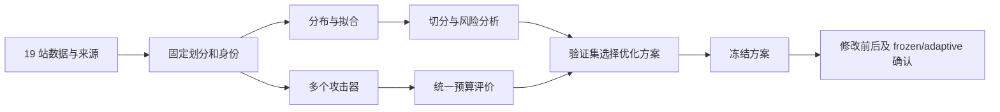

# ZipfGuard 第二次核验：真实小实验已跑通，完整科研验收未完成

日期：2026-09-26。检查对象为提交 `7c5fa35` 加当前工作区的新文件和修改。本报告接续同日第一次核验，不覆盖旧记录；旧记录中的“没有新增攻击结果”只适用于当时快照。

## 一、总体判断与系统位置

当前项目已经从“协议、适配器和数据摘要”推进到了“真实数据上的多模型小预算探索”。这个进步属实。但如果“都做完了”指完成 19 站实验、原场景复现和创新验证，则不能验收。项目自己的 `confirmation.json` 仍标注 incomplete，当前 A00–A12 状态表也没有任何得到确认的创新结论。

整个研究应当这样闭环：先明确 19 站数据代表什么，固定训练、验证、测试划分；用训练数据研究分布和拟合，用验证数据选参数；由多个攻击器生成候选，评价器在统一成本下计算测试命中；最后将分布、拟合、特征分析与攻击风险连接起来，在原文修改前后场景中验证优化。当前主要打通的是其中一条小链路，前端数据身份和后端公平计量仍有缺口，最终确认实验尚未完成。

## 二、我实际重新验证了什么

本轮运行了四组单元测试，共 20 项通过：`test_research19_pipeline`、`test_research19_identity`、`test_evaluation_validity`、`test_distributions`。测试通过说明这些现有测试所覆盖的行为正常，不能替代科研实验和公平性检查。

我使用项目 `.venv/bin/python`，重新读取 hak5，并按 seed=19 划分为训练 1790、验证 596、测试 598 条 occurrence。复跑采用当前模型脚本的实际函数，评价输出另存到 `reports/review_2026-09-26_v2.json`，不覆盖原实验 JSON。OMEN 的本次工作目录单独设在临时目录。报告不保存口令明文。

| 路径 | 本轮核验内容 | 能证明什么 |
| --- | --- | --- |
| 训练频次词典 | 预算 100 命中 68；1000 命中 134 | 训练频次排序和测试计数可以重现 |
| 作者 OMEN | 生成 1000，唯一 1000；命中 36、36 | 已有真实 OMEN 无反馈生成路径 |
| PCFG 开放生成 | 生成 1000，唯一 1000；命中 26、74 | 新路径不再先与测试候选表求交 |
| PassGPT | 生成 1000，唯一 1000；两个预算均命中 0 | 模型确实加载和生成；这一小实验没有命中 |
| PassLLM | 保留输出 1000，唯一 968；唯一预算 100 命中 9，968 命中 10，1000 未完成 | 作者随机采样路径可以重现，不等价于 DivideSearch；生成成本另见下文 |

上述结果与已有报告一致；本轮 PassGPT 用时约 9.2 秒，PassLLM 约 75.5 秒，权重校验值也匹配原报告。上述命中都是 598 条测试 occurrence 的计数，不能自动写成已经核实的账户人数。PassGPT 覆盖最多 10 字符，测试中有 77 条超出长度域；域内 521 条也未命中。因此 0 不是漏跑标记，但不能据此断言该模型普遍无效。

PassGPT/PassLLM 使用已有公开检查点，与只使用当前训练划分的频次、OMEN、PCFG 有不同的训练历史。当前脚本披露了 RockYou 暴露，这是必要进展；要形成同条件比较，还需要单列预训练模型组及跨库重叠检查。

## 三、阻碍验收的评价问题

### 1. P1：同一个预算字段混用了原始输出次数和唯一候选数

`core/attack_stream.py` 第 64–80 行把传入序列的位置作为猜测次数。PCFG 调用传入原始 stream，见 `experiments/research19_smoke.py` 第 98–103 行；OMEN 传入 ordered_unique，见第 76–77 行；神经模型也传入 ordered_unique，见 `experiments/research19_neural_eval.py` 第 61–73 行。

我构造了一个不含真实数据的反例：先输出同一个错误候选 100 次，再输出目标，然后输出其他候选。原始预算 100 时未命中；当前神经模型评价路径先去重，预算 100 时却报告命中。同一个标签代表了不同成本，反例已写入审计 JSON。

唯一候选预算本身可以是合理的验证成本口径。问题在于当前几条路径没有统一，并且文档还把它们写成生成预算。必须同时保留原始生成位置、有效输出数、唯一候选位置、实际验证数和耗时，明确每条曲线的横轴。去重不应抹掉生成成本。此次经典模型恰好没有重复，因此不能由这个缺陷反推它们已报告的命中数必然错误；缺陷影响后续公平比较和含重复模型。

### 2. P1：通用评价器没有完成状态，短流也会标记完整预算

同一函数无条件输出 `incomplete=False`。本轮将只有一条候选的序列交给它，要求预算 1000，仍得到完成状态。神经脚本外层补了唯一候选不足时的判定，但其他路径没有统一保护。

必须区分正常到达预算、有限词典完整耗尽、资源限制截断、运行失败和中断。有限词典确实完全枚举时，预算上限内的结果可以有效；仅凭序列短，既不能证明完整耗尽，也不能证明已完成请求。当前接口缺少这些证据。

### 3. P1：PassLLM 的“1000 原始输出”不是实际采样成本

项目 `experiments/research19_neural_eval.py` 第 174–184 行调用作者 `random_sample`，随后把它返回的文本当作原始流。作者归档 `local_attack_models/passllm/Available artifacts for USENIX Security 2025 #772-v1/src/search/search.py` 第 313–343 行先按 sample_size×1.1 安排批次，再随机抽取 sample_size 个结果，最后按分数排序。

请求 1000、batch_size=8 时实际安排 138 批，即启动 1104 条采样轨迹。是否每条都在长度上限前正常结束是另一项需要记录的数量。返回的 1000 是筛选后的保留输出，排序后的前 100 也不是生成过程最早的 100 条。

这种“生成候选池再排序”的攻击策略可以研究，但要报告候选池生成成本和排序后验证成本。不能把它当作与其他原始顺序流等成本的 1000 次生成实验。当前路径也明确没有运行 DivideSearch，不能据此宣布完整复现 PassLLM 论文。

## 四、数据与可复现性仍有问题

### 4. P2：split hash 丢失频次信息，还存在分隔符碰撞

`experiments/research19_splits.py` 第 44–46 行先把 rows 转成 set，再用换行连接。人工数据 `[a,a,b]` 与 `[a,b,b]` 的总条数、不同字符串数都相同，指纹也相同，但它们的经验分布不同。本轮还确认，含换行的两组不同字符串也可能产生相同拼接内容。

应使用无歧义的规范化序列化，将字符串与计数一起哈希；如果行顺序影响训练，再保存顺序身份。当前 unique-disjoint 划分只有 hak5 清单，且主攻击仍使用 occurrence 划分，没有完成 19 站两套协议的实验。

### 5. P2：未核实账户语义被标成适用账户风险

`experiments/distribution_diagnostics.py` 第 31 行把 `frequency_use == occurrence_not_verified_accounts` 映射成 `account_risk_applicable=True`。本轮执行后有 17 站触发该标记。这与字段名称和数据卡限制冲突。

如果想表达“可以计算 occurrence 加权指标”，应改为这个明确含义，账户层适用性单独保留 unknown。当前不能把 17 站出现次数直接解释成经过核实的账户人数。

### 6. 上一轮的问题尚未收口

当前源码仍由固定默认词表产生缓存身份，实际 `--lexicon` 没有传入缓存键；实际解析依赖 `core/counted_corpus.py` 仍不在分析源码指纹中。旧 `build_figures.py` 也没有接入历史协议检查，原有逐曲线独立缩放路径仍在。pickle 的字符串处理仍包含静默移除换行的逻辑。

这些判断来自本轮源码复核；相关反例来自同日第一份审计及 `reports/review_2026-09-26_checks.json`，本轮没有把旧反例伪称为再次运行。真实数据受换行处理影响的规模仍未量化。新增 research19 图表不等于旧图表入口已经安全退出。

“一键复跑”也只是小预算流程：`experiments/research19_rerun.py` 第 10–17 行不包含神经评价、split 清单、拟合比较和完整确认产物。`local_attack_models/README.md` 仍说缺 torch、尚未生成，但项目虚拟环境已能运行，文档需要同步。下载模型目录被忽略，之后应提供固定版本、权重校验、依赖锁定及恢复步骤。

## 五、五个重点方向分别完成到了哪里

分布层已经有 19 站摘要和尺度诊断，但摘要来自已有聚合，不等于重新做完 19 站分布研究。下一步需要统一频次语义与预处理，产生可追溯的分布曲线，再把分布差异与攻击难度联系起来。

拟合层有 7 个小站 OLS，只有 hak5 进行了三模型比较，另外 12 站仍 incomplete。当前比较属于同一样本上的拟合，没有独立测试证明模型选择能预测攻击风险。还有实际资源问题：`research19_fit_small.py` 第 27–31 行先全量读入，才判断数据是否超过上限，这不能避免大站读入内存的代价。应先解决可扩展读取，再在训练/验证上选择模型，测试集仅负责评价。

分析层已经从简单统计走向 hak5 的子样本稳定性和频次命中特征关联，但尚未形成跨站、多攻击器、控制长度和频次等因素后的解释。质量阈值实验在 `research19_stability.py` 第 50、59 行固定使用 0.5，并非验证集选定的阈值；两种切分的集合规模也不同，Jaccard 差异需要配套集合规模控制和风险区分指标。不能用一次小实验宣称更稳定，也不能据此否定全部可能的质量阈值方案。

攻击层已经有五条本机可执行路径，这是本轮最实质的进展。但主要证据集中在 hak5、1000 级别；7 小站频次矩阵不等于 19 站多模型矩阵。FLA、PassGAN、PassFlow 没有完成运行，PassLLM 只有随机采样路径。应先保证当前几种模型公平计量，再扩大数据、种子和预算，而不是以增加模型名字代替完整实验。

评价层已经明确使用验证集选择最佳单模型，也记录了未完成预算和长度域，但预算语义、完成状态、结果身份尚未统一。原场景的修改前后、frozen/adaptive 确认仍为空。因此目前没有证据支持“安全性得到提升”，也不能以测试全部通过替代这个证据。

两个创新假设目前都是探索对象。H1 的 hak5 Jaccard 结果约为曲率 0.734、质量阈值 0.455，没有显示当前质量阈值更稳定。H2 的等额配额是三模型各 300，测试命中 93，而验证集选中的单模型在总预算 900 命中 127；但这只是固定等额基线，尚未实现假设中的分布驱动配额优化。因此准确表述是“当前基线未获收益，所提优化机制尚待实现和确认”，不是“创新做完了”或“创新已被彻底否定”。这些数字来自现有报告，本轮没有另跑这两项。

## 六、下一轮的验收顺序

下一轮先统一评价合同，把本轮预算反例、短流状态、原始/唯一位置、候选池排序成本、split 指纹和账户语义变成真实调用链测试，同时修复上一轮缓存与历史图表缺口。验收标准应是换模型、出现重复、发生截断时仍能明确说清“花了多少成本、验证了多少候选、完成到哪里”。

然后冻结一套小实验协议，在多个规模可控站点上完成全部现有模型、多个种子以及长度域和训练暴露分组。先由这些结果检查跨站一致性，再决定扩展大站和高预算；大站不能简单以当前内存上限永久跳过。

最后才进入创新确认：实现真正的验证集选阈值或分布驱动配额，与等额分配、验证集最佳单模型等基线比较；控制总成本，固定方案后在未参与选择的测试数据上评价，补回原论文修改前后和 frozen/adaptive 场景。即使结论为无收益，也应作为完整研究结果保留。

## 七、核验边界与产物

本轮只新增审计文档和聚合检查记录，没有修改生产算法。执行了小规模真实模型复跑和人工评价反例；没有重新计算 19 个大站的全部拟合，没有运行高预算或完整论文实验，也没有重新审定文献权威性。

最终结论：**小预算多模型链路可以验收为阶段性工程成果；公平评价、19 站实验、原场景确认和创新证据不能验收为全部完成。**
